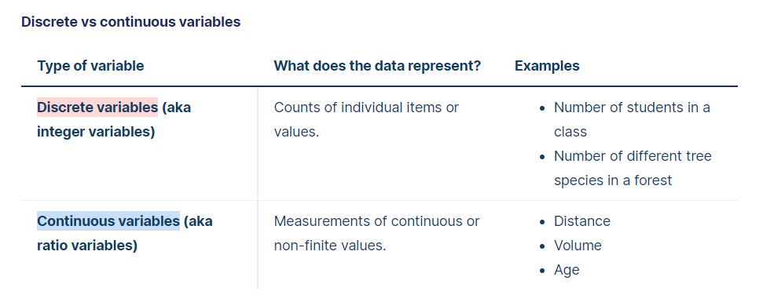
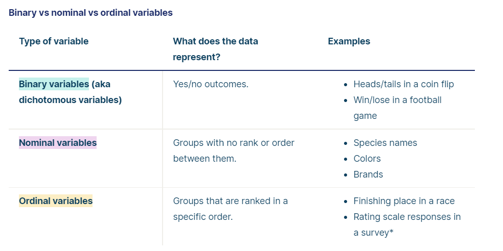
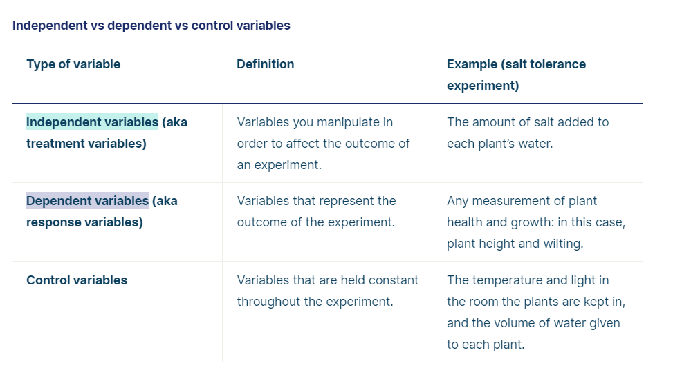

# Types of data

Suppose that you want to test whether some **plant species** are more **salt-tolerant** than others, some key variables you might measure include **the amount of salt** you add to the water, **the species of plants** being studied, and variables related to plant health like **growth** and **wilting**.

Data is a specific measurement of a variable – it is the value you record in your data sheet. Data is generally divided into two categories:

1. Quantitative data: represents amounts.
2. Categorical data: represents groupings.

## Quantitative variables: (comes with units)

When you collect quantitative data, the numbers you record represent real amounts that can be **added**, **subtracted**, **divided**, etc.

There are two types of quantitative variables: **discrete** and **continuous**

## Categorical variables

Categorical variables represent groupings of some kind. They are sometimes recorded as numbers, but the numbers represent categories rather than actual amounts of things.

There are three types of categorical variables: **binary**, **nominal**, and **ordinal** variables.

## Independent vs Dependent vs Control variables

In scientific research, we often want to study the effect of one variable on another one. For example, you might want to test whether students who spend more time studying get better exam scores.

The variables in a study of a **cause-and-effect relationship** are called the **independent** and **dependent** variables.

1. **The independent variable** is the **cause**. Its value is independent of other variables in your study.
2. **The dependent variable** is the **effect**. Its value depends on changes in the independent variable.
3. **A control variable** is anything that is held constant or limited in a research study. It’s a variable that is not of interest to the study’s aims, but is controlled because it could influence the outcomes.

