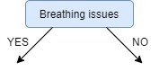

# Decision Tree

**Classification** is a **two-step process**, **learning step** and **prediction step**, in machine learning.

In the **learning step**, the model is developed based on given training data.
In the **prediction step**, the model is used to predict the response for given data.

**Decision Tree** is one of the easiest and popular classification algorithms to understand and interpret.

## Decision Tree Algorithm

Decision Tree algorithm belongs to the family of **supervised learning algorithms**. Unlike other supervised learning algorithms, the decision tree algorithm can be used for solving **regression** and **classification** problems too.

The goal of using a Decision Tree is to create a training model that can be used to predict the **class** or **value** of the target variable by learning **simple decision rules** inferred from prior data(training data).

In Decision Trees, for predicting a **class label** for **a record** we start from the **root** of the tree. We compare the values of the root attribute with the record’s attribute. On the basis of comparison, we follow the branch corresponding to that value and jump to the next node.

## Types of Decision Trees

Types of decision trees are based on the **type of target variable** we have. It can be of **two types**:

### 1. Classification Tree (Categorical Variable Decision Tree)

A Decision Tree which has a **categorical target variable** then it called a Categorical variable decision tree.

### 2. Regression Tree (Continuous Variable Decision Tree)

A Decision Tree has a **continuous target variable** then it is called Continuous Variable Decision Tree.

Let’s say we have a problem to predict whether a customer will pay his renewal premium with an insurance company **(yes/ no)**.
Here we know that the **income** of customers is a significant variable but the insurance company does not have income details for all customers.
Now, as we know this is an important variable, then we can build a **decision tree to predict customer income** based on _occupation_, _product_, and _various other variables_.
In this case, we are predicting values for the **continuous variables**.

## Important Terminology related to Decision Trees


### 1. Root Node

It represents the entire population or sample and this further gets divided into two or more homogeneous sets.

### 2. Splitting

It is a process of dividing a node into two or more sub-nodes.

### 3. Decision Node

When a sub-node splits into further sub-nodes, then it is called the decision node.

### 4. Leaf / Terminal Node

Nodes do not split is called Leaf or Terminal node.

### 5. Pruning

When we remove sub-nodes of a decision node, this process is called pruning. You can say the opposite process of **splitting**.

### 6. Branch / Sub-Tree

A subsection of the entire tree is called branch or sub-tree.

### 7. Parent and Child Node

A node, which is divided into sub-nodes is called a **parent node** of sub-nodes whereas sub-nodes are the **child** of a parent node.

Decision trees classify the examples by sorting them down the tree from the **root** to some **leaf/terminal node**, with the leaf/terminal node providing the classification of the example.

Each **node** in the tree acts as a **test case for some attribute**, and each **edge** descending from the node corresponds to the **possible answers to the test case**. This process is **recursive in nature** and is repeated for every subtree rooted at the new node.

## Assumptions while creating Decision Tree

Below are some of the assumptions we make while using Decision tree:

* In the **beginning**, the **whole training set** is considered as **the root**.
* Feature values are preferred to be **categorical**. If the values are **continuous** then they are **discretized** prior to building the model.
* Records are **distributed recursively** on the basis of attribute values.
* Order to placing attributes as root or internal node of the tree is done by using some **statistical approach**.

The **primary challenge** in the decision tree implementation is to _identify which attributes do we need to consider as the **root node** at each level_. Handling this is to know as the **attributes selection**.
We have different **attributes selection measures** to identify the attribute which can be considered as the root note at each level.

## How do Decision Trees work?

The decision of making **strategic splits** heavily affects a tree’s accuracy. The decision criteria are different for **classification** and **regression trees**.

Decision trees use multiple algorithms to decide to split a node into two or more sub-nodes. The creation of sub-nodes increases the **homogeneity of resultant sub-nodes**.
In other words, we can say that the **purity** of the node increases _with respect to the **target variable**_.
The decision tree splits the nodes on all available variables and then _selects **the spli**t which results in **most homogeneous sub-nodes**_.

The algorithm selection is also based on the **type of target variables**.
Let us look at some algorithms used in Decision Trees:

* **ID3** → (**Iterative Dichotomiser 3**, extension of **D3**)
* **C4.5** → (successor of **ID3**)
* **CART** → (**Classification And Regression Tree**)
* **CHAID** → (**Chi-square Automatic Interaction Detection**, Performs multi-level splits when computing classification trees)
* **MARS** → (**Multivariate Adaptive Regression Splines**)

## Attribute Selection Measures

If the dataset consists of **N** attributes then deciding **which attribute** to place at the **root** or at different levels of the tree as internal nodes is a complicated step.
By just randomly selecting any node to be the root can’t solve the issue. If we follow a random approach, it may give us bad results with low accuracy.

For solving this **attribute selection problem**, researchers worked and devised some solutions.
They suggested using some criteria like :

1. **Entropy**
2. **Information gain**
3. **Gini index**
4. **Gain Ratio**
5. **Reduction in Variance**
6. **Chi-Square**

These criteria will calculate **values** for **every attribute**. The values are sorted, and attributes are placed in the tree by following the order i.e, the attribute with a high value(in case of **information gain**) is placed at the root.
While using **Information Gain** as a criterion, we assume attributes to be **categorical**, and for the **Gini index**, attributes are assumed to be **continuous**.

## Entropy

Entropy is a **measure of the randomness** in the information being processed. The **higher** the entropy, the **harder** it is to draw any conclusions from that information.
**Flipping a coin** is an example of an action that provides information that is **random**.


From the above graph, it is quite evident that the entropy **H(X)** is **zero** when the **probability** is either **0** or **1**.
The Entropy is **maximum** when the probability is **0.5** because it projects perfect **randomness** in the data and there is no chance if **perfectly determining the outcome**.

> **ID3** follows the rule — A branch with an **entropy of zero** is a **leaf node** and A brach with **entropy more than zero** needs **further splitting**.
> ___
>
> ### More about Entropy
>
> A widely used metric with decision trees is **entropy**. **Shannon’s Entropy**, named after **Claude Shannon** provides us with **measures of uncertainty**.
>
> When it comes to data, entropy tells us **how messy** our data is. A **high entropy** value indicates **less predictive power**, think of the entropy of a feature as **the amount of information in that feature**.
>
> Decision trees work to maximize the **purity** of the classes when making **splits**, providing more **clarity** of the classes in the **leaf nodes**.
>
> * The entropy is calculated **before** and **after** each split.
> * If the entropy **increases**, another split will be tried or the branch of the tree will stop, i.e., the current tree has the lowest entropy.
>
> * If the entropy **decreases**, the split will be kept.

### Mathematically Entropy for one attribute is represented as


Where **S** → Current state, and **Pi** → Probability of an event **i** of state **S** or Percentage of class **i** in a node of state **S**.

### Mathematically Entropy for multiple attributes is represented as


where **T** → Current state and **X** → Selected attribute

## Information Gain

**Information gain** or **IG** is a **statistical property** that measures _**how well** a given attribute **separates** the training examples according to their target classification_.
Constructing a decision tree is all about finding **an attribute** that returns the **highest information gain** and the **smallest entropy**.


_Information gain is **a decrease** in entropy_.
It computes the difference between **entropy before split** and **average entropy after split** of the dataset based on given attribute values.

**ID3 (Iterative Dichotomiser)** decision tree algorithm uses information gain.

Mathematically, IG is represented as:


In a much simpler way, we can conclude that:


Where **“before”** is the **dataset before the split**, **K** is the **number of subsets generated by the split**, and **(j, after)** is **subset j** after the split.

### Steps to split a decision tree using Information Gain

1. For **each spli**t, individually calculate the entropy of each child node
2. Calculate the entropy of each split as the **weighted average entropy** of child nodes
3. Select the split with the **lowest entropy or highest information gain**
4. Until you achieve **homogeneous nodes**, repeat steps **1-3**

## Gini Index (Gini Impurity)

You can understand the **Gini index** as a **cost function** used to evaluate splits in the dataset. It is calculated by _subtracting the sum of the squared probabilities of each class from one_.
It favors **larger partitions** and easy to implement whereas **information gain** favors **smaller partitions** with distinct values.


Gini Index works with the **categorical target variable** **“Success”** or **“Failure”**. It performs only **Binary splits**.

> **Higher** value of Gini index implies **higher inequality**, **higher heterogeneity**.

### Steps to Calculate Gini index for a split

1. Calculate **Gini** for sub-nodes, using the above formula for **success(p)** and **failure(q)** **(1- p² + q²)**.

2. Calculate the Gini index for split using the **weighted Gini score** (**w1. gi1 + w2 . gi2**) of each node of that split. (**weight** is calculated as **#records_in_nodei /#records_in_both_nodes**)

**CART (Classification and Regression Tree)** uses the Gini index method to create split points.

## Gain ratio

**Information gain** is **biased** towards choosing _attributes with a **large** number of values_ as **root** nodes. It means it prefers the attribute with a **large number of distinct values** (attributes with more possible categories).

**C4.5**, an improvement of **ID3**, uses **Gain ratio** which is a **modification** of **Information gain** that _reduces its **bias**_ and is usually the best option.

Gain ratio overcomes the problem with information gain by taking into account the **number of branches** that would result before making the split.

It corrects information gain by taking the intrinsic information of a split into account.


Where **“before”** is the dataset before the split, **K** is the number of subsets generated by the split, and **(j, after)** is subset **j** after the split. (**Wj** stands for probability)

> 

## Reduction in Variance

Reduction in variance is an algorithm used for **continuous target variables** (**regression problems**). This algorithm uses the standard formula of variance to choose the best split. The split with **lower variance** is selected as the criteria to split the population:


Variance is used for calculating the homogeneity of a node. If a node is entirely **homogeneous**, then the variance is zero.

Here are the steps to split a decision tree using reduction in variance:

1. For each split, individually calculate the variance of each child node
2. Calculate the variance of each split as the weighted average variance of child nodes
3. Select the split with the **lowest variance**
4. Perform steps 1-3 until completely **homogeneous nodes** are achieved

## Chi-Square

Chi-square is another method of splitting nodes in a decision tree for datasets having **categorical target values**. It can make two or more than two splits.

The acronym **CHAID** stands for **Chi-squared Automatic Interaction Detector**. It is one of the oldest tree classification methods. It finds out the **statistical significance** between the **differences** between sub-nodes (child nodes) and parent node.

Chi-Square value is:


Here, the **Expected** is the **expected value for a class** in a **child node** _**based** on the **distribution** of classes in the **parent node**_, and **Actual** is the **actual value for a class** in a **child node**.

The above formula gives us the value of Chi-Square for **a class**. Take the sum of Chi-Square values for all the classes in a node to calculate the Chi-Square for that node.

The **higher** the value, **higher** will be the differences between parent and child nodes, i.e., **higher** will be the **homogeneity**.

> ### Example
>
> 
> The parent node has a total of **20** students and out of those **10** play cricket and **10** do not. So, of course, the percent of students who **do play** cricket will be **50%** and the percent of students who **do not play** cricket will be **50%**.
>
> Now if we consider the **“Above average” node**, there are **14** students in it, as the percentage of students who play cricket is **50%** in the parent node, the **expected number of students who play cricket** will of course be **7** and if you look at the actual value it is **8**.
>
> Now, if the actual and expected values are the same, Can you guess what will be the chi-square value? It’s actually pretty simple, it will be **zero** because both the actual and expected are the same and the difference will be zero.
>
> If both values are the same we can generate an inference that the distribution of the child node is **the same as** the parent node and hence, **we are not improving the purity of the nodes**.
>
> On the other hand, if the chi-square value is **high** it means that the distribution of child nodes is **changing** with respect to the parent node and we are going in a direction to achieve **more pure nodes**.

Here are the steps to split a decision tree using Chi-Square:

1. For each split, individually calculate the Chi-Square value of each child node by taking the sum of Chi-Square values for each class in a node
2. Calculate the Chi-Square value of each split as the sum of Chi-Square values for all the child nodes
3. Select the split with higher Chi-Square value
4. Until you achieve homogeneous nodes, repeat steps **1-3**

## How to avoid/counter Overfitting in Decision Trees?

The common problem with Decision trees, especially having a table full of columns, **they fit a lot**. Sometimes it looks like the tree **memorized** the training data set. If there is **no limit** set on a decision tree, it will give you **100%** accuracy on the training data set because in the worse case it will end up making **1 leaf** for each observation. Thus this affects the accuracy when predicting samples that are not part of the training set.

Here are two ways to remove overfitting:

1. **Pruning Decision Trees**.
2. **Random Forest**.

## ID3 in brief

In this article, we’ll be using a sample dataset of **COVID-19 infection**. A preview of the entire dataset is shown below.

ID | Fever | Cough | Breathing issues | Infected
----|-------------|------------------|----------|-----
1 | NO | NO | NO | NO |
2 | YES | YES | YES | YES |
3 | YES | YES | NO | NO |
4 | YES | NO | YES | YES |
5 | YES | YES | YES | YES |
6 | NO | YES | NO | NO |
7 | YES | NO | YES | YES |
8 | YES | NO | YES | YES |
9| NO | YES | YES | YES |
10 | YES | YES | NO | YES |
11 | NO | YES | NO | NO |
12 | NO | YES | YES | YES |
13 | NO | YES | YES | NO |
14 | YES | YES | NO | NO |

### Steps in ID3 algorithm

1. It begins with the original set **S** as the root node.
2. On each iteration of the algorithm, it iterates through the unused attribute of the set **S** and calculates **Entropy(H)** and **Information gain(IG)** of this attribute.
3. It then selects the attribute which has the smallest Entropy or Largest Information gain.
4. The set **S** is then split by the selected attribute to produce a subset of the data.
5. The algorithm continues to recur on each subset, considering only attributes never selected before.

> **Entropy(S) = — (8/14) * log₂(8/14) — (6/14) * log₂(6/14) = 0.99**

We now calculate the **Information Gain** for each feature:

#### IG calculation for Fever

As shown below, in the **8** rows with **YES** for Fever, there are **6** rows having target value **YES** and **2** rows having target value **NO**:

ID | Cough | Breathing issues | Infected
----|-------------|------------------|----------|
2 | YES | YES | YES |
3 | YES | NO | NO |
4 | NO | YES | YES |
5 | YES | YES | YES |
7 | NO | YES | YES |
8 | NO | YES | YES |
10 | YES | NO | YES |
14 | YES | NO | NO |

As shown below, in the **6** rows with **NO**, there are **2** rows having target value **YES** and **4** rows having target value **NO**:

ID | Cough | Breathing issues | Infected
----|-------------|------------------|----------|
1 | NO | NO | NO |
6 | YES | NO | NO |
9 | YES | YES | YES |
11 | YES | NO | NO |
12 | YES | YES | YES |
13 | YES | YES | NO |

```console
# total rows
|S| = 14

For v = YES, |Sᵥ| = 8
Entropy(Sᵥ) = - (6/8) * log₂(6/8) - (2/8) * log₂(2/8) = 0.81

For v = NO, |Sᵥ| = 6
Entropy(Sᵥ) = - (2/6) * log₂(2/6) - (4/6) * log₂(4/6) = 0.91

# Expanding the summation in the IG formula:
IG(S, Fever) = Entropy(S) - (|Sʏᴇꜱ| / |S|) * Entropy(Sʏᴇꜱ) - (|Sɴᴏ| / |S|) * Entropy(Sɴᴏ)

∴ IG(S, Fever) = 0.99 - (8/14) * 0.81 - (6/14) * 0.91 = 0.13
```

Next, we calculate the IG for the features “Cough” and “Breathing issues”:

```console
IG(S, Cough) = 0.04
IG(S, BreathingIssues) = 0.40
```

Since the feature **Breathing issues** have the **highest Information Gain** it is used to create the **root node**.

Hence, after this initial step our tree looks like this:



Next, from the remaining two unused features, namely, **Fever** and **Cough**, we decide which one is the best for the left branch of **Breathing Issues**.

Since the left branch of **Breathing Issues** denotes **YES**, we will work with the subset of the original data i.e the set of rows having **YES** as the value in the Breathing Issues column. These **8** rows are shown below:

ID | Fever | Cough | Breathing issues | Infected
----|-------------|------------------|----------|-----
2 | YES | YES | YES | YES |
4 | YES | NO | YES | YES |
5 | YES | YES | YES | YES |
7 | YES | NO | YES | YES |
8 | YES | NO | YES | YES |
9| NO | YES | YES | YES |
12 | NO | YES | YES | YES |
13 | NO | YES | YES | NO |

and We keep building the tree like this ..


## CART in brief

CART is an alternative decision tree building algorithm. It can handle both **classification** and **regression** tasks. This algorithm uses a metric named **gini index** to create decision points for classification tasks.

### Dataset

There are **14** instances of **golf playing** decisions based on **outlook**, **temperature**, **humidity** and **wind factors**.

Day | Outlook | Temp. | Humidity | Wind | Decision
----|---------|-------|----------|------|---------
1 | Sunny | Hot | High | Weak | No
2 | Sunny | Hot | High | Strong | No
3 | Overcast | Hot | High | Weak | Yes
4 | Rain | Mild | High | Weak | Yes
5 | Rain | Cool | Normal | Weak | Yes
6 | Rain | Cool | Normal | Strong | No
7 | Overcast | Cool | Normal | Strong | Yes
8 | Sunny | Mild | High | Weak | No
9 | Sunny | Cool | Normal | Weak | Yes
10 | Rain | Mild | Normal | Weak | Yes
11 | Sunny | Mild | Normal | Strong | Yes
12 | Overcast | Mild | High | Strong | Yes
13 | Overcast | Hot | Normal | Weak | Yes
14 | Rain | Mild | High | Strong | No

#### Outlook

Outlook | Yes | No | Number of instances
--------|-----|----|--------------------
Sunny | 2 | 3 | 5
Overcast | 4 | 0 | 4
Rain | 3 | 2 | 5

```console
Gini(Outlook=Sunny) = 1 – (2/5)2 – (3/5)2 = 1 – 0.16 – 0.36 = 0.48

Gini(Outlook=Overcast) = 1 – (4/4)2 – (0/4)2 = 0

Gini(Outlook=Rain) = 1 – (3/5)2 – (2/5)2 = 1 – 0.36 – 0.16 = 0.48

Then, we will calculate weighted sum of gini indexes for outlook feature.

Gini(Outlook) = (5/14) x 0.48 + (4/14) x 0 + (5/14) x 0.48 = 0.171 + 0 + 0.171 = 0.342
```

#### Temperature

Temperature | Yes | No | Number of instances
------------|-----|----|--------------------
Hot | 2 | 2 | 4
Cool | 3 | 1 | 4
Mild | 4 | 2 | 6

```console
Gini(Temp=Hot) = 1 – (2/4)2 – (2/4)2 = 0.5

Gini(Temp=Cool) = 1 – (3/4)2 – (1/4)2 = 1 – 0.5625 – 0.0625 = 0.375

Gini(Temp=Mild) = 1 – (4/6)2 – (2/6)2 = 1 – 0.444 – 0.111 = 0.445

We’ll calculate weighted sum of gini index for temperature feature

Gini(Temp) = (4/14) x 0.5 + (4/14) x 0.375 + (6/14) x 0.445 = 0.142 + 0.107 + 0.190 = 0.439
```

#### Humidity

Humidity | Yes | No | Number of instances
---------|-----|----|--------------------
High | 3 | 4 | 7
Normal | 6 | 1 | 7

```console
Gini(Humidity=High) = 1 – (3/7)2 – (4/7)2 = 1 – 0.183 – 0.326 = 0.489

Gini(Humidity=Normal) = 1 – (6/7)2 – (1/7)2 = 1 – 0.734 – 0.02 = 0.244

Weighted sum for humidity feature will be calculated next

Gini(Humidity) = (7/14) x 0.489 + (7/14) x 0.244 = 0.367
```

#### Wind

Wind | Yes | No | Number of instances
-----|-----|----|--------------------
Weak | 6 | 2 | 8
Strong | 3 | 3 | 6

```console
Gini(Wind=Weak) = 1 – (6/8)2 – (2/8)2 = 1 – 0.5625 – 0.062 = 0.375

Gini(Wind=Strong) = 1 – (3/6)2 – (3/6)2 = 1 – 0.25 – 0.25 = 0.5

Gini(Wind) = (8/14) x 0.375 + (6/14) x 0.5 = 0.428
```

#### Time to decide

We’ve calculated gini index values for each feature. The winner will be **outlook** feature because its cost is the lowest.

Feature | Gini index
--------|-----------
Outlook | 0.342
Temperature | 0.439
Humidity | 0.367
Wind | 0.428

We’ll put **outlook** decision at the top of the tree:


You might realize that sub dataset in the **overcast leaf** has **only yes decisions**. This means that overcast leaf is over.


#### Decision for sunny outlook

We’ve calculated gini index scores for feature when outlook is sunny. The winner is humidity because it has the lowest value.

Feature | Gini index
--------|-----------
Temperature | 0.2
Humidity | 0
Wind | 0.466

We’ll put **humidity** check at the extension of **sunny outlook**.


As seen, decision is always **no** for **high humidity** and **sunny outlook**. On the other hand, decision will always be **yes** for **normal humidity** and **sunny outlook**. This branch is over.


We keep building our tree like this, and the final tree will be the following:


## Regression Tree in brief

Decision trees are powerful way to **classify** problems.
On the other hand, they can be adapted into **regression** problems, too.
Decision trees which built for a data set where the the target column could be **real number** are called **regression trees**. In this case, approaches such as **information gain** for **ID3**, **gain ratio** for **C4.5**, or **gini index** for **CART** won’t work. Still, this is **CART** algorithm.

Besides, regular decision tree algorithms are designed to create branches for **categorical features**. Still, we are able to build trees with **continuous** and **numerical** features. The trick is here that we will _convert continuos features into categorical_. We will split the numerical feature where it offers the highest information gain.

### Our Dataset

Herein, the **target** column is **number of golf players** and it stores **real numbers**.

We have counted the number of instances for each class when the target was **nominal**. It means that we can create branches based on the number of instances for **true** decisions and **false** decisions.

Here, we cannot **count** the **target values** because it is **continuous**. Instead of counting, we can handle **regression problems** by switching the metric to **standard deviation**.

Day | Outlook | Temp. | Humidity | Wind | Golf Players
----|---------|-------|----------|------|-------------
1 | Sunny | Hot | High | Weak | 25
2 | Sunny | Hot | High | Strong | 30
3 | Overcast | Hot | High | Weak | 46
4 | Rain | Mild | High | Weak | 45
5 | Rain | Cool | Normal | Weak | 52
6 | Rain | Cool | Normal | Strong | 23
7 | Overcast | Cool | Normal | Strong | 43
8 | Sunny | Mild | High | Weak | 35
9 | Sunny | Cool | Normal | Weak | 38
10 | Rain | Mild | Normal | Weak | 46
11 | Sunny | Mild | Normal | Strong | 48
12 | Overcast | Mild | High | Strong | 52
13 | Overcast | Hot | Normal | Weak | 44
14 | Rain | Mild | High | Strong | 30

#### Standard deviation

```console
Golf players = {25, 30, 46, 45, 52, 23, 43, 35, 38, 46, 48, 52, 44, 30}

Average of golf players = (25 + 30 + 46 + 45 + 52 + 23 + 43 + 35 + 38 + 46 + 48 + 52 + 44 + 30
)/14 = 39.78

Standard deviation of golf players =  √[( (25 – 39.78)2 + (30 – 39.78)2 + (46 – 39.78)2 + … + (30 – 39.78)2 )/14] = 9.32
```

### Outlook Attribute

#### Sunny outlook

Day | Outlook | Temp. | Humidity | Wind | Golf Players
----|---------|-------|----------|------|-------------
1 | Sunny | Hot | High | Weak | 25
2 | Sunny | Hot | High | Strong | 30
8 | Sunny | Mild | High | Weak | 35
9 | Sunny | Cool | Normal | Weak | 38
11 | Sunny | Mild | Normal | Strong | 48

```console
Golf players for sunny outlook = {25, 30, 35, 38, 48}

Average of golf players for sunny outlook = (25+30+35+38+48)/5 = 35.2

Standard deviation of golf players for sunny outlook = √(((25 – 35.2)2 + (30 – 35.2)2 + … )/5) = 7.78
```

#### Overcast outlook

Day | Outlook | Temp. | Humidity | Wind | Golf Players
----|---------|-------|----------|------|-------------
3 | Overcast | Hot | High | Weak | 46
7 | Overcast | Cool | Normal | Strong | 43
12 | Overcast | Mild | High | Strong | 52
13 | Overcast | Hot | Normal | Weak | 44

```console
Golf players for overcast outlook = {46, 43, 52, 44}

Average of golf players for overcast outlook = (46 + 43 + 52 + 44)/4 = 46.25

Standard deviation of golf players for overcast outlook = √(((46-46.25)2+(43-46.25)2+…)= 3.49
```

#### Rainy outlook

Day | Outlook | Temp. | Humidity | Wind | Golf Players
----|---------|-------|----------|------|-------------
4 | Rain | Mild | High | Weak | 45
5 | Rain | Cool | Normal | Weak | 52
6 | Rain | Cool | Normal | Strong | 23
10 | Rain | Mild | Normal | Weak | 46
14 | Rain | Mild | High | Strong | 30

```console
Golf players for overcast outlook = {45, 52, 23, 46, 30}

Average of golf players for overcast outlook = (45+52+23+46+30)/5 = 39.2

Standard deviation of golf players for rainy outlook = √(((45 – 39.2)2+(52 – 39.2)2+…)/5)=10.87
```

#### Summarizing standard deviations for the outlook feature

Outlook | Stdev of Golf Players | Instances
--------|-----------------------|----------
Overcast | 3.49 | 4
Rain | 10.87 | 5
Sunny | 7.78 | 5

```console
Weighted standard deviation for outlook = (4/14)x3.49 + (5/14)x10.87 + (5/14)x7.78 = 7.66
```

You might remember that we have calculated the **global standard deviation** of golf players **9.32** in previous steps.

**Standard deviation reduction** is _**difference** of the global standard deviation and standard deviation for current feature_. In this way, **maximized** standard deviation reduction will be the decision node.

`Standard deviation reduction for outlook = 9.32 – 7.66 = 1.66`

After we calculate the reduction in **Standard Deviation** for all attributes:

Feature | Standard Deviation Reduction
--------|-----------------------------
Outlook | 1.66
Temperature | 0.47
Humidity | 0.27
Wind | 0.29

The winner is **outlook** because it has the highest score.

We’ll put outlook decision at the top of decision tree:


### Sunny Outlook

Day | Outlook | Temp. | Humidity | Wind | Golf Players
----|---------|-------|----------|------|-------------
1 | Sunny | Hot | High | Weak | 25
2 | Sunny | Hot | High | Strong | 30
8 | Sunny | Mild | High | Weak | 35
9 | Sunny | Cool | Normal | Weak | 38
11 | Sunny | Mild | Normal | Strong | 48

Calculate the reduction in standard deviation for **sunny outlook** with the other attributes ..

Feature | Standard Deviation Reduction
--------|-----------------------------
Temperature | 4.18
Humidity | 3.33
Wind | 0.85

The winner is **temperature**.


**Cool branch** has **one instance** in its sub data set. We can say that if outlook is sunny and temperature is cool, then there would be **38** golf players.

But what about **hot branch**? There are still **2** instances. Should we add another branch for **weak wind** and **strong wind**? **No**, we should not. Because this causes **over-fitting**.

We should **terminate building branches**, for example if there are **less than five** instances in the **sub data set**. Or standard deviation of the sub data set can be less **than 5%** of the entire data set.

We will to apply the first one. We will terminate the branch if there are less than **5** instances in the current sub data set. If this termination condition is satisfied, then we will calculate the **average** of the sub data set. This operation is called as **pruning in decision trees**.

#### After pruning


### Now for Overcast outlook

Day | Outlook | Temp. | Humidity | Wind | Golf Players
----|---------|-------|----------|------|-------------
3 | Overcast | Hot | High | Weak | 46
7 | Overcast | Cool | Normal | Strong | 43
12 | Overcast | Mild | High | Strong | 52
13 | Overcast | Hot | Normal | Weak | 44

Overcast outlook branch has already **4** instances in the sub data set. We can terminate building branches for this leaf. Final decision will be average of the following table for overcast outlook.

`If outlook is overcast, then there would be (46+43+52+44)/4 = 46.25 golf players.`

### Rainy Outlook

Day | Outlook | Temp. | Humidity | Wind | Golf Players
----|---------|-------|----------|------|-------------
4 | Rain | Mild | High | Weak | 45
5 | Rain | Cool | Normal | Weak | 52
6 | Rain | Cool | Normal | Strong | 23
10 | Rain | Mild | Normal | Weak | 46
14 | Rain | Mild | High | Strong | 30

As illustrated below, the winner is **wind** feature.

Feature | Standard deviation reduction
--------|-----------------------------
Temperature | 0.67
Humidity | 0.37
Wind | 7.62


As seen, both branches have items less than **5**. Now, we can terminate these leafs based on the **termination rule**.


## Pruning Decision Trees

One of the most common problem when learning a decision tree is to learn the **optimal size** of the **resulting tree** that leads to a better accuracy of the model.
A tree that has **too many branches and layers** can result in **overfitting** of the training data.

**Pruning a decision tree** helps to prevent overfitting the training data so that our model generalizes well to unseen data. Pruning a decision tree means to **remove a subtree** that is **redundant** and **not a useful split** and replace it with a leaf node.

Decision tree pruning can be divided into two types: **pre-pruning** and **post-pruning**.

## Pre-pruning

**Pre-pruning**, also known as **Early Stopping Rule**, is the method where the subtree construction is **halted** at a particular node after **evaluation of some measure**. These measures can be the **Gini Impurity** or the **Information Gain**.

In pre-pruning, we evaluate the pruning condition based on the above measures at each node. Examples of pruning conditions include **`informationGain(Attr) > minGain`** or **`treeDepth == MaxDepth`**. If the condition is satisfied, we prune the subtree. That means we **replace** the **decision node** with a **leaf node**. Otherwise, we continue building the tree using our decision tree algorithm.


Pre-pruning has the advantage of being faster and more efficient as it avoids generating overly complex subtrees which overfit the training data.
However, in pre-pruning, the growth of the tree is stopped prematurely by our stopping condition.

## Post-pruning

As the name suggests, **post-pruning** means to prune **after** the tree is **built**. You grow the tree entirely using your decision tree algorithm and then you prune the subtrees in the tree in a **bottom-up fashion**.

You start from the **bottom decision node** and, **based on measures** such as **Gini Impurity** or **Information Gain**, you decide whether to keep this decision node or replace it with a leaf node. _For example_, say we want to prune out subtrees that result in **least information gain**.

## Pruning algorithms

There are many pruning algorithms out there; below are three examples of pruning algorithms.

### Pruning by information gain

We can prune our decision tree by using **information gain** in both **post-pruning** and **pre-pruning**.

* In **pre-pruning**, we check whether **information gain** at a particular node is **greater** than **minimum gain**.
* In **post-pruning**, we prune the subtrees with the **least information gain** until we reach a **desired number of leaves**.

### Reduced Error Pruning (REP)

**REP** belongs to the **Post-Pruning** category.
In REP, pruning is performed with the help of a **validation set**. In REP, all nodes are evaluated for pruning in a **bottom up fashion**.

A node is pruned if the resulting pruned tree performs **no worse** than the original tree on the **validation set**. The subtree at the node is replaced with a leaf node which is assigned the **most common class**.

### Cost-complexity pruning

**Cost-complexity pruning** also falls under the **post-pruning** category.

Cost-complexity pruning works by calculating a **Tree Score** based on **Residual Sum of Squares (RSS)** for the subtree, and a **Tree Complexity Penalty** that is a function of the **number of leaves** in the subtree.

> 

The **Tree Complexity Penalty** compensates for the difference in the number of leaves.

Numerically, Tree Score is defined as follows:


We calculate the **Tree Score** for all subtrees in the decision tree, and then pick the subtree with the **lowest Tree Score**.

However, we can observe from the equation that the value of **alpha** determines the choice of the subtree. The value of alpha is found using **cross-validation**. We repeat the above process for different values of **alpha**, which gives us a sequence of trees. The value of alpha that **on average** gives the **lowest Tree Score** is the final value of alpha. Finally, our pruned decision tree will be tree **corresponding** to the final value of **alpha**.
