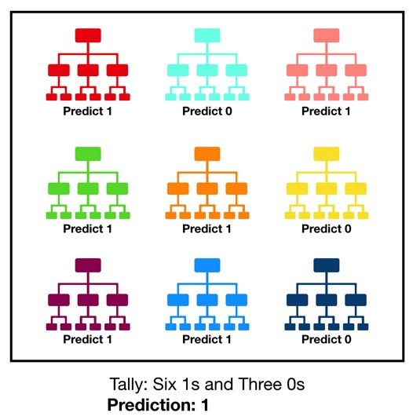

# Random Forest

In the Machine Learning world, **Random Forest models** are a kind of **non parametric models** that can be used both for **regression** and **classification**. They are one of the most popular **ensemble methods**, belonging to the specific category of **Bagging methods**.

**Ensemble methods** involve using **many learners** to enhance the performance of any single one of them individually. These methods can be described as techniques that use a **group of weak learners** (those who on average achieve only slightly better results than a **random model**) together, in order to create a **stronger**, **aggregated one**.

> **Bagging**, also known as **bootstrap aggregation**, is the **ensemble learning method** that is commonly used to **reduce variance** within a **noisy** dataset.
>
> In bagging, a **random sample of data** in a training set is selected **with replacement**—meaning that the individual data points can be chosen **more** than once.
>
> After several data samples are generated, these weak models are then trained independently, and depending on the type of task—**regression** or **classification**, for example—the **average** or **majority** of those predictions yield a **more accurate estimate**.

In our case, **Random Forests** are an **ensemble of many individual Decision Trees**.

One of the main **drawbacks of Decision Trees** is that they are _very prone to **over-fitting**_: they do well on training data, but are not so flexible for making predictions on unseen samples. While there are workarounds for this, like **pruning the trees**, _this reduces their **predictive power**_. Generally they are models with **medium bias** and **high variance**, but they are simple and easy to interpret.

**Random Forest** models combine the **simplicity of Decision Trees** with the **flexibility and power of an ensemble model**.

In a forest of trees, we forget about the high variance of an specific tree, and are less concerned about each individual element, so we can grow nicer, larger trees that have more predictive power than a pruned one.

Although Random Forest models _don’t offer as much interpret ability as a single tree_, their performance is a lot better, and we don’t have to worry so much about perfectly tuning the parameters of the forest as we do with individual trees.

## Training and Building a Random Forest

Building a random Forest has **3 main phases**. We will break down each of them and clarify each of the concepts and steps.

### Creating a Bootstrapped Data Set for each tree

When we build an **individual decision tree**, we use a training data set and all of the observations. This means that if we are not careful, the tree can **adjust very well** to this training data, and generalise badly to new, unseen observations. To solve this issue, we **stop** the tree from **growing very large**, usually at the cost of reducing its performance.

To build a **Random Forest** we have to train **N decision trees**. _Do we train the trees using the **same data all the time**_? _Do we use the **whole** data set_? **Nope**.

This is where the first **random feature** comes in.
To train **each individual tree**, _we pick a **random sample** of the entire Data set_, like shown in the following figure.

From looking at this figure, various things can be deduced. First of all, the size of the data used to train each individual tree does not have to be the size of the whole data set. Also, a data point can be present more than once in the data used to train a single tree (like in **tree nº two**).

This is called **Sampling with Replacement** or **Bootstrapping**: each data point is picked randomly from the whole data set, and a data point can be picked **more than once**.

By using different samples of data to train each individual tree we reduce one of the main problems that they have: _they are very fond of their training data_.

If we train a **forest** with a **lot of trees** and each of them has been trained with **different data**, we solve this problem. They are all very fond of their training data, but the forest is not fond of any specific data point. This allows us to **grow larger individual trees**, as we do not care so much anymore for an individual tree overfitting.

If we use a **very small portion of the whole data set** to train each individual tree, we **increase the randomness** of the forest (**reducing over-fitting**) but usually at the cost of a **lower performance**.

In practice, by default most Random Forest implementations (like the one from **Scikit-Learn**) pick the sample of the training data used for each tree to be the **same size as** the **original data set** (however it is not the same data set, remember that we are picking **random** samples).

This generally provides a **good bias-variance compromise**.

### Train a forest of trees using these random data sets, and add a little more randomness with the feature selection

If you remember well, for building an **individual decision tree**, at each node we evaluated a certain **metric** (like the **Gini index**, or **Information Gain**) and picked the **feature** or **variable** of the data to go in the node that **minimised**/**maximised** this metric.

This worked decently well when training only one tree, but now we want a **whole forest of them**! How do we do it?

**Ensemble models**, like **Random Forest** work best if the **individual models** (**individual trees** in our case) are **uncorrelated**.
In **Random Forest** this is achieved by _**randomly selecting certain features** to evaluate at each node_.

As you can see from the previous image, **at each node** we evaluate **only a subset of all the initial features**.

* For the **root node** we take into account **E, A and F** (and **F wins**).

* In **Node 1** we consider **C, G and D** (and **G wins**).

* Lastly, in **Node 2** we consider only **A, B, and G** (and **A wins**).

We would carry on doing this until we built the whole tree.

By doing this, we **avoid including features** that have a **very high predictive power** in **every tree**, while creating many **un-correlated trees**. This is the second sweep of **randomness**.
We do not only use **random data**, but also **random features** when building each tree.

The **greater** the **tree diversity**, the **better**: we reduce the variance, and get a better performing model.

### Repeat this for the N trees to create our awesome forest

We have learned how to build a **single decision tree**. Now, we would repeat this for the **N trees**, randomly selecting on each node of each of the trees which variables enter the contest for being picked as the feature to split on.

In conclusion, the whole process goes as follows:

1. Create a **bootstrapped data** set for each tree.
2. Create a **decision tree** using its **corresponding data** set, but at **each node** use a **random sub sample of variables or features** to split on.
3. Repeat all these three steps **hundreds of times** to build a massive forest with a wide variety of trees. This variety is what makes a Random Forest way better than a single decision tree.

Once we have built our forest, we are ready to use it to make awesome predictions.

## Making predictions using a Random Forest

Making predictions with a Random Forest is very easy.
We just have to take each of our individual trees, pass the observation for which we want to make a prediction through them, get a prediction from every tree (summing up to **N** predictions) and then obtain an **overall, aggregated prediction**.

**Bootstrapping the data** and then using an **aggregate** to make a prediction is called **Bagging**, and how this prediction is made depends on the kind of problem we are facing.

* For **regression problems**, the **aggregate decision** is the **average** of the decisions of every single decision tree.
* For **classification problems**, the final prediction is the **most frequent** prediction done by the forest.

The previous image illustrates this very simple procedure.

For the **classification problem** we want to predict if a certain patient is **sick** or **healthy**. For this we pass his medical record and other information through each tree of the random forest, and obtain **N** predictions (**400** in our case). In our example **355** of the trees say that the patient is **healthy** and **45** say that the patient is **sick**, therefore the forest decides that the patient is **healthy**.

For the **regression problem** we want to predict the **price** of a certain house. We pass the characteristics of this new house through our **N** trees, getting a **numerical prediction** from each of them. Then, we calculate the **average** of these predictions and get the final value of **322.750$**.

## What is the Out of Bag score in Random Forests?

**Out of bag (OOB)** score is a way of **validating** the Random forest model.

For the description of **OOB score** calculation, let’s assume there are **five DTs (Decision Trees)** in the random forest ensemble labeled from **1** to **5**.

For simplicity, suppose we have a simple original training data set as below.

Let the **first bootstrap sample** is made of the first three rows of this data set as shown in the **green box** below.
This bootstrap sample will be used as the training data for the **DT “1”**.

Then the **last row** that is **“left out”** in the original data (see the **red box** in the image below) is known as **Out of Bag sample**.
This row will not be used as the training data for **DT 1**.
Please note that in reality there will be several such rows which are left out as Out of Bag, here for simplicity only one is shown.

After the **DTs models** have been trained, this **leftover row** or the **OOB sample** will be given as **unseen data** to the **DT 1**.
The **DT 1** will **predict** the outcome of this row. Let **DT 1** predicts this row correctly as **“YES”**.

Similarly, this row will be passed through **all the DTs** that did not contain this row in their **bootstrap training data**.
Let’s assume that apart from **DT 1**, **DT 3** and **DT 5** also did not have this row in their bootstrap training data. The predictions of this row by **DT 1**, **3**, **5** are summarized in the table below.

We see that by a **majority vote** of **2 “YES”** vs **1 “NO”** the prediction of this row is **“YES”**.
It is noted that the final prediction of this row by majority vote is a correct prediction since originally in the **“Play Tennis”** column of this row is also a **“YES”**.

Similarly, each of the **OOB sample rows** is passed through **every DT** that **did not contain** the **OOB sample row** in **its bootstrap training** data and a majority prediction is noted for each row.

And lastly, the **OOB score** is computed as the _number of **correctly** predicted rows from the out of bag sample_.

### What is the difference between OOB score and validation score?

As compared to the **validation score**, **OOB score** is computed on data that was not necessarily used in the analysis of the model. Whereas for calculation **validation score**, a part of the original training dataset is actually set aside before training the models.

Additionally, the **OOB score** is calculated using only a **subset of DTs** not containing the **OOB sample** in their bootstrap training dataset. While the **validation score** is calculated using **all the DTs** of the ensemble.

### Where can OOB score be useful?

As noted above, only a **subset of DTs** is used for determining the **OOB score**. This leads to **reducing** the overall aggregation effect in bagging.
Thus in general, **validation** on a **full ensemble of DTs** is better than a **subset of DT** for estimating the score.

However, occasionally the dataset **is not big enough** and hence set aside a part of it for **validation** is unaffordable. Consequently, in cases where we do not have a large dataset and want to consume it all as the training dataset, the **OOB score** provides a **good trade-off**.

Nonetheless, it should be noted that validation score and OOB score are unalike, computed in a different manner and should not be thus compared.

> In an ideal case, about **36.8 %** of the total training data forms the **OOB sample**. This can be shown as follows.
>
> If there are **N** rows in the training data set. Then, the **probability of not picking** a row in a random draw is
>
> 
>
> Using **sampling-with-replacement** the probability of not picking **N** rows in random draws is
>
> 
>
> which in the limit of large **N** becomes equal to
>
> 
>
> Therefore, about **36.8 %** of total training data are available as **OOB sample** for each DT and hence it can be used for evaluating or validating the random forest model.
