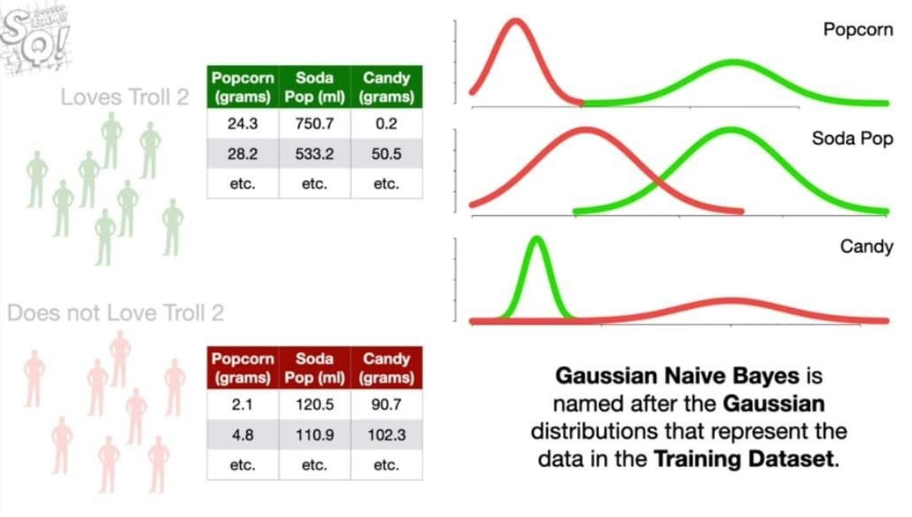

# Naive Bayes Classification

## What is Naive Bayes?

**Naive Bayes** are a family of powerful and easy-to-train **classifiers**, which **determine** the **probability of an outcome**, given a set of **conditions** using the **Bayes’ theorem**. In other words, the **conditional probabilities** are inverted so that the query can be expressed as a function of **measurable quantities**.

The approach is simple and the adjective **naive** has been attributed not because these algorithms are limited or less efficient, but because of a **fundamental assumption** about the **causal factors** that we will discuss.

**Naive Bayes** are **multi-purpose classifiers** and it’s easy to find their application in many different contexts. However, the performance is particularly good in all those situations when the probability of a class is determined by the **probabilities** of some **causal factors**.
A good example is given by **natural language processing**, where a text can be considered as a particular instance of a dictionary and the **relative frequencies** of all terms provide enough information to infer a belonging class.

Our examples may be generic, so to let you understand the application of naive Bayes in various context.

## The Bayes’ theorem

Let’s consider two **probabilistic events** **A** and **B**.
We can correlate the **marginal probabilities P(A)** and **P(B)** with the **conditional probabilities P(A|B)** and **P(B|A)** using the product rule:


Considering that the **intersection is commutative**, the first members are equal, so we can **derive the Bayes’ theorem**:


This formula has very deep philosophical implications and it’s a fundamental element of statistical learning.

First of all, let’s consider the **marginal probability P(A)**: this is normally a value that determines how probable a target event is, like **P(Spam)** or **P(Rain)**. As there are no other elements, this kind of probability is called **Apriori**, because it’s often determined by **mathematical considerations** or simply by a **frequency count**.

For example, imagine we want to implement a very simple **spam filter** and we’ve collected **100** emails.
We know that **30** are spam and **70** are regular. So we can say that **P(Spam) = 0.3**.

However, we’d like to evaluate using some **criteria** (for simplicity, let’s consider a **single one**), for example, e-mail text is _shorter than **50** characters_.
Therefore, our query becomes:


The first term is similar to **P(Spam)** because it’s the _probability of spam given a certain **condition**_. For this reason, it’s called a **posteriori** (in other words, it’s a probability that can estimate **after** knowing some additional elements).

On the right side, we need to calculate the missing values, but it’s simple. Let’s suppose that **35** emails have a text shorter than **50** characters, **P(Text < 50 chars) = 0.35** and, looking only into our spam folder, we discover that only **25** spam emails have a short text, so that **P(Text < 50 chars|Spam) = 25/30 = 0.83**. The result is:


So, after receiving a very short email, there is **71%** probability that it’s a **spam**.

Now we can understand the role of **P(Text < 50 chars|Spam)**: as we have actual data, we can measure how probable is our hypothesis given the query, in other words, we have defined a **likelihood** which is a **weight** between the **Apriori probability** and the a **posteriori one** (the term on the denominator is less important because it works as **normalizing factor**):


The **normalization factor** is often represented by the Greek letter **alpha**, so the formula becomes:


The last step is considering the case when there are **more concurrent conditions** (that is more realistic in real-life problems):


A **common assumption** is called **conditional independence** (in other words, the effects produced by every cause are independent among each other) and allows us to write a **simplified expression**:


## Naive Bayes classifiers

A **naive Bayes classifier** is called in this way because it’s based on a **naive condition**, which implies the **conditional independence of causes**.
This can seem very difficult to accept in many contexts where the probability of a particular feature is **strictly correlated** to another one.

For example, in **spam filtering**, a _text shorter than **50** characters_ can **increase** the probability of the _presence of an image_, In other words, the **presence of a cause** isn’t normally **independent** from the **presence of other ones**.

However, in _Zhang H., The Optimality of Naive Bayes, AAAI 1, no. 2 (2004): 3_, the author showed that under particular conditions (not so rare to happen), _different dependencies **clears** one another_, and a naive Bayes classifier succeeds in achieving very high performances even if its naiveness is violated.

Let’s consider a dataset:


Every feature vector, for simplicity, will be represented as:


We need also a target dataset:


where each y can belong to one of **P** different classes.
Considering the **Bayes’ theorem under conditional independence**, we can write:


The values of the **marginal Apriori probability P(y)** and of the **conditional probabilities P(xi|y)** is obtained through a **frequency count**, therefore, given an input vector **x**, the predicted class is the one which a **posteriori probability is maximum**.

## Naive Bayes in scikit-learn

**scikit-learn** implements **three** naive Bayes variants based on the same number of different probabilistic distributions: **Bernoulli**, **multinomial**, and **Gaussian**.

* The **first one** is a **binary distribution** useful when a feature can be **present** or **absent**.

* The **second one** is a **discrete distribution** used whenever a feature must be represented by a **whole number** (for example, in natural language processing, it can be the **frequency of a term**).

* The **latter** is a **continuous distribution** characterized by its **mean** and **variance**.

### Bernoulli naive Bayes

If **X** is random variable **Bernoulli-distributed**, it can assume only **two** values (for simplicity, let’s call them **0** and **1**) and their probability is:


To try this algorithm with **scikit-learn**, we’re going to generate a **dummy dataset**.

> ### Make Classification API
>
> **`sklearn.datasets.make_classification(n_samples=100, n_features=20, *, n_informative=2, n_redundant=2, n_repeated=0, n_classes=2, n_clusters_per_class=2, weights=None, flip_y=0.01, class_sep=1.0, hypercube=True, shift=0.0, scale=1.0, shuffle=True, random_state=None)`**
>
> Generate a random **n-class** classification problem.
>
> This initially creates **clusters of points normally distributed** (**std=1**) about **vertices** of an **`n_informative`-dimensional hypercube** with sides of length `2*class_sep` and assigns an equal number of clusters to each class. It introduces **interdependence** between these features and adds **various types** of further **noise** to the data.
>
> Without shuffling, **X** horizontally stacks features in the following order: the primary `n_informative` features, followed by `n_redundant` linear combinations of the informative features, followed by `n_repeated` duplicates, drawn randomly with replacement from the informative and redundant features. The remaining features are filled with random noise. Thus, without shuffling, all useful features are contained in the columns **X[:, :n_informative + n_redundant + n_repeated]**.
>
> 1. **n_samples** : int, default=100
> The number of samples
>
> 2. **n_features** : int, default=20
> The total number of features. These comprise `n_informative` informative features, `n_redundant` redundant features, `n_repeated` duplicated features and `n_features - n_informative - n_redundant - n_repeated` useless features drawn at random.

```python
from sklearn.datasets import make_classification

>>> nb_samples = 300
>>> X, Y = make_classification(n_samples=nb_samples, n_features=2, n_informative=2, n_redundant=0)
```


**Bernoulli naive Bayes** expects **binary feature vectors**, however, the class **BernoulliNB** has a **binarize parameter** which allows specifying a threshold that will be used internally to transform the features.

We have decided to use **0.0** as a binary threshold, so each point can be characterized by the quadrant where it’s located.

```python
from sklearn.naive_bayes import BernoulliNB
from sklearn.model_selection import train_test_split

>>> X_train, X_test, Y_train, Y_test = train_test_split(X, Y, test_size=0.25)

>>> bnb = BernoulliNB(binarize=0.0)
>>> bnb.fit(X_train, Y_train)
>>> bnb.score(X_test, Y_test)
0.85333333333333339
```

The score in rather good, but if we want to understand how the **binary classifier** worked, it’s useful to see how the data have been internally binarized:


Now, checking the naive Bayes predictions we obtain:

```python
>>> data = np.array([[0, 0], [0, 1], [1, 0], [1, 1]])
>>> bnb.predict(data)
array([0, 0, 1, 1])
```

## Multinomial naive Bayes

A **multinomial distribution** is useful to model feature vectors where each value represents, for example, the number of occurrences of a term or its relative frequency.
If the feature vectors have **n** elements and each of them can assume **k** different values with probability **pk**, then:


The conditional probabilities **P(xi|y)** are computed with a **frequency count** (which corresponds to applying a **maximum likelihood approach**), but in this case, it’s important to consider the **alpha parameter** (called **Laplace smoothing factor**) which default value is **1.0** and **prevents** the model from setting null probabilities when the frequency is **zero**.
It’s possible to assign all non-negative values, however, larger values will assign **higher** probabilities to the **missing features** and this choice could alter the stability of the model. In our example, we’re going to consider the default value of **1.0**.

For our purposes, we’re going to use the `DictVectorizer`.

Let’s consider only two records: the first one representing a **city**, while the second one **countryside**.
Our dictionary contains hypothetical frequencies, like if the terms were extracted from a text description:

```python
from sklearn.feature_extraction import DictVectorizer

>>> data = [
{'house': 100, 'street': 50, 'shop': 25, 'car': 100, 'tree': 20},

{'house': 5, 'street': 5, 'shop': 0, 'car': 10, 'tree': 500, 'river': 1}
] 

>>> dv = DictVectorizer(sparse=False)
>>> X = dv.fit_transform(data)
>>> Y = np.array([1, 0])

>>> X
array([[ 100.,  100.,    0.,   25.,   50.,   20.],
[  10.,    5.,    1.,    0.,    5.,  500.]])

# car, house, river, shop, street, tree
```

Note that the term **‘river’** is missing from the first set, so it’s useful to keep **alpha** equal to **1.0** to give it a **small probability**.

The output classes are **1** for **city** and **0** for the **countryside**. Now we can train a **MultinomialNB** instance:

```python
from sklearn.naive_bayes import MultinomialNB

>>> mnb = MultinomialNB()
>>> mnb.fit(X, Y)
MultinomialNB(alpha=1.0, class_prior=None, fit_prior=True)

# fit_prior : bool, default=True, Whether to learn class prior probabilities or not. If false, a uniform prior will be used.

# class_prior : array-like of shape (n_classes,), default=None, Prior probabilities of the classes. If specified the priors are not adjusted according to the data.
```

To test the model, we create a **dummy city** **with** a **river** and a **dummy country** place **without** any **river**.

```python
>>> test_data = data = [
{'house': 80, 'street': 20, 'shop': 15, 'car': 70, 'tree': 10, 'river': 
1},

]
{'house': 10, 'street': 5, 'shop': 1, 'car': 8, 'tree': 300, 'river': 0} 

>>> mnb.predict(dv.fit_transform(test_data))
array([1, 0])
```

Even if the multinomial distribution is based on the **number of occurrences**, it can be successfully used with **frequencies** or more **complex functions**.

## Gaussian Naive Bayes

**Gaussian Naive Bayes** is useful when working with **continuous values** which probabilities can be modeled using a **Gaussian distribution**:


The conditional probabilities **P(xi|y)** are also **Gaussian distributed** and, therefore, it’s necessary to estimate **mean** and **variance** of each of them using the **maximum likelihood approach**.



This quite easy, in fact, considering the property of a Gaussian, we get:


Where the **k** index refers to the samples in our dataset and **P(xi|y)** is a **Gaussian** itself.

By **minimizing** the **inverse of this expression** (in _Russel S., Norvig P., Artificial Intelligence: A Modern Approach, Pearson_ there’s a complete analytical explanation), we get **mean** and **variance** for each **Gaussian** associated to **P(xi|y)** and the model is hence trained.
