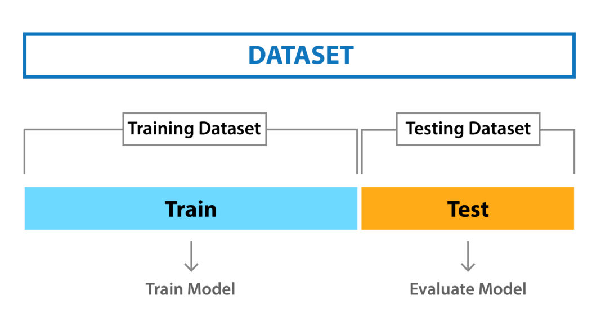
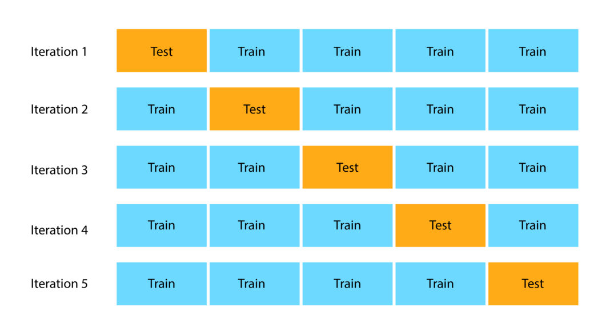
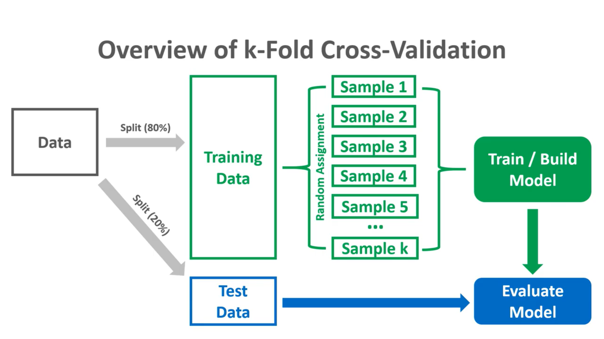
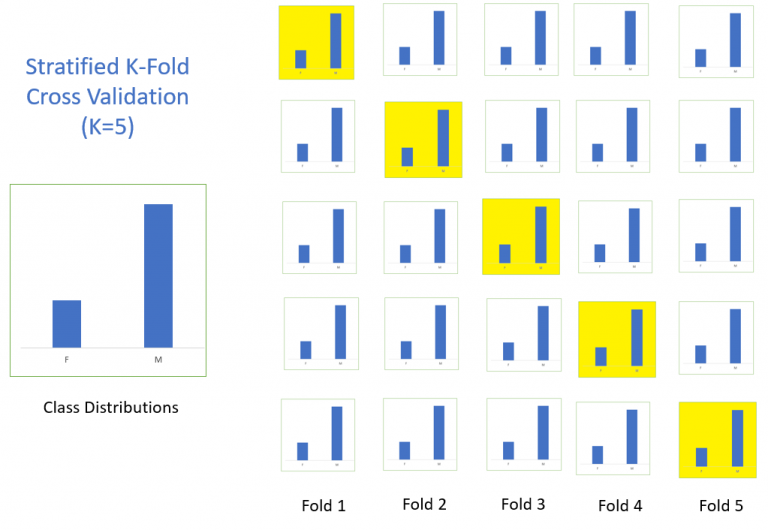
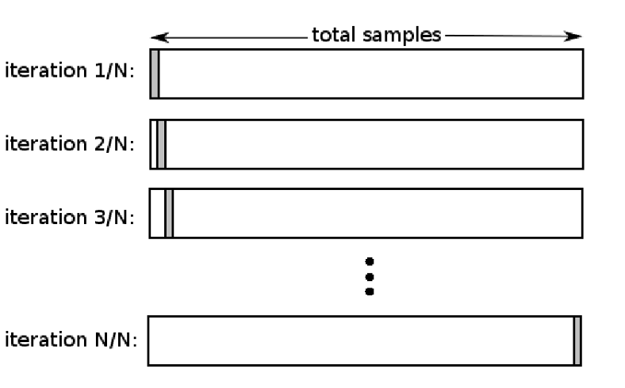

# Cross Validation

## When dealing with a Machine Learning task, you have to properly identify the problem so that you can pick the most suitable algorithm which can give you the best score

But how do we compare the models?

Say, you have trained the model with the dataset available and now you want to know how well the model can perform.

One approach can be that you are going to test the model on the dataset you have trained it on, but this may not be a good practice

If we do so, we assume that the training data represents all the possible scenarios of real-world and this will surely never be the case.

Our main objective is that the model should be able to work well on the real-world data, although the training dataset is also real-world data, it represents a small set of all the possible data points(examples) out there.

So to know the real score of the model, it should be tested on the data that it has never seen before and this set of data is usually called **testing set**.

But if we split our data into **training data** and **testing data**, aren’t we going to lose some important information that the test dataset may hold?

So, Let's see the different types of **cross validation** and find out the answers?

## Cross-Validation

Cross-validation is a resampling procedure used to evaluate machine learning models on a limited data sample.

There are different types of cross validation methods, and they could be classified into two broad categories – **Non-exhaustive** and **Exhaustive Methods**.

## Non-exhaustive Methods

Non-exhaustive cross validation methods, as the name suggests do not compute all ways of splitting the original data.

## 1. Holdout method

This is a quite basic and simple approach in which we divide our entire dataset into two parts **training data** and **testing data**.

As the name, we train the model on training data and then evaluate on the testing set.

Usually, the size of training data is set more than twice that of testing data, so the data is split in the ratio of **70:30** or **80:20**.

In this approach, the data is first shuffled randomly before splitting.

As the model is trained on a different combination of data points, the model can give different results every time we train it, and this can be a cause of **instability**. Also, we can never assure that the train set we picked is representative of the whole dataset.

Also when our dataset is not too large, there is a high possibility that the testing data may contain some important information that we lose as we do not train the model on the testing set.

The hold-out method is good to use when you have a very large dataset, you’re on a time crunch, or you are starting to build an initial model in your data science project.

## 2. K-fold cross-validation

K-fold cross validation is one way to improve the **holdout method**.

This method guarantees that the score of our model does not depend on the way we picked the train and test set.

The data set is divided into **k** number of subsets and the holdout method is repeated k number of times.

Let us go through this in steps:

1. Randomly split your entire dataset into **k** number of folds (subsets)
2. For each fold in your dataset, build your model on **k – 1 folds** of the dataset. Then, test the model to check the effectiveness for **kth fold**
3. Repeat this until each of the k-folds has served as the test set
4. The average of your k recorded accuracy is called the cross-validation accuracy and will serve as your performance metric for the model.

Because it ensures that every observation from the original dataset has the chance of appearing in training and test set, this method generally results in a less biased model compare to other methods. It is one of the best approaches if we have limited input data.

The disadvantage of this method is that the training algorithm has to be rerun from scratch k times, which means it takes k times as much computation to make an evaluation.

## 3. Stratified K-Fold Cross-Validation

Using K Fold on a classification problem can be tricky.

Since we are randomly shuffling the data and then dividing it into folds, chances are we may get highly imbalanced folds which may cause our training to be biased.

For example, let us somehow get a fold that has majority belonging to one class(say positive) and only a few as negative class. This will certainly ruin our training and to avoid this we make **stratified folds** using **stratification**.

**Stratification** is the process of rearranging the data so as to ensure that each fold is a good representative of the whole.

For example, in a binary classification problem where each class comprises of 50% of the data, it is best to arrange the data such that in every fold, each class comprises of about half the instances.

## Exhaustive Methods

Exhaustive cross validation methods test on all possible ways to divide the original sample into a training and a validation set.

## 1. Leave-P-Out cross validation

When using this exhaustive method, we take **p** number of points out from the total number of data points in the dataset (say **n**).

While training the model we train it on these (**n – p**) data points and test the model on **p** data points.

We repeat this process for all the possible combinations of p from the original dataset. Then to get the final accuracy, we average the accuracies from all these iterations.

This is an exhaustive method as we train the model on every possible combination of data points.

Remember if we choose a higher value for p, then the number of combinations will be more and we can say the method gets a lot more exhaustive.

## 2. Leave-one-out cross validation

This is a simple variation of **Leave-P-Out cross validation** and the value of **p** is set as **one**. This makes the method much less exhaustive as now for n data points and p = 1, we have n number of combinations.

