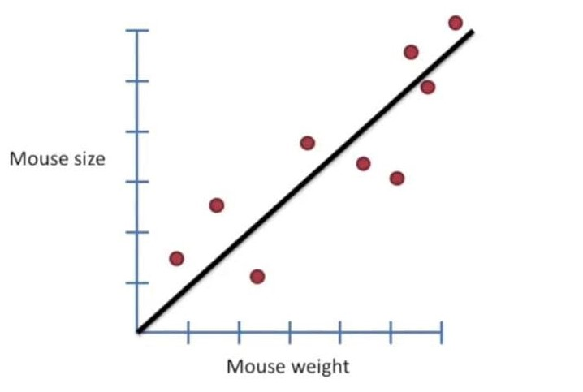
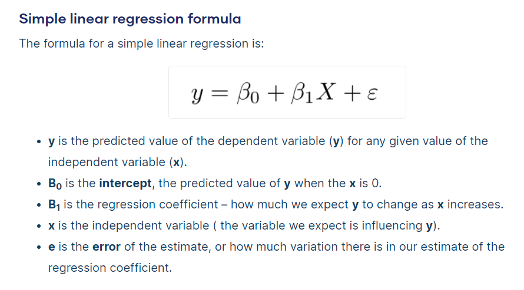
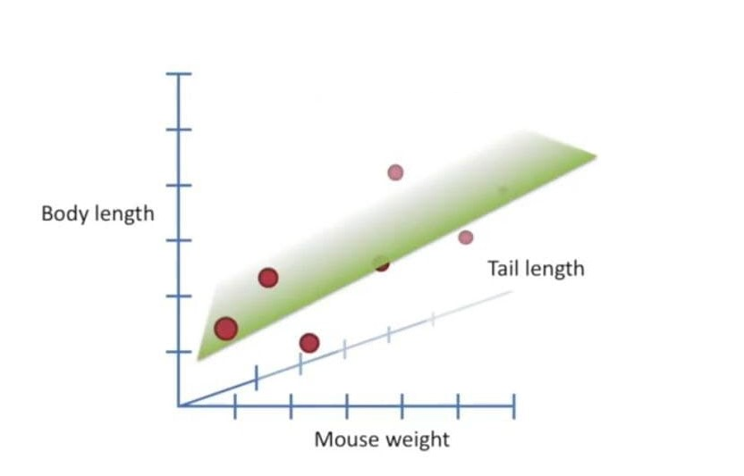
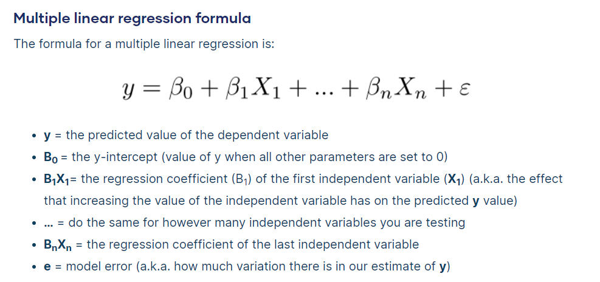
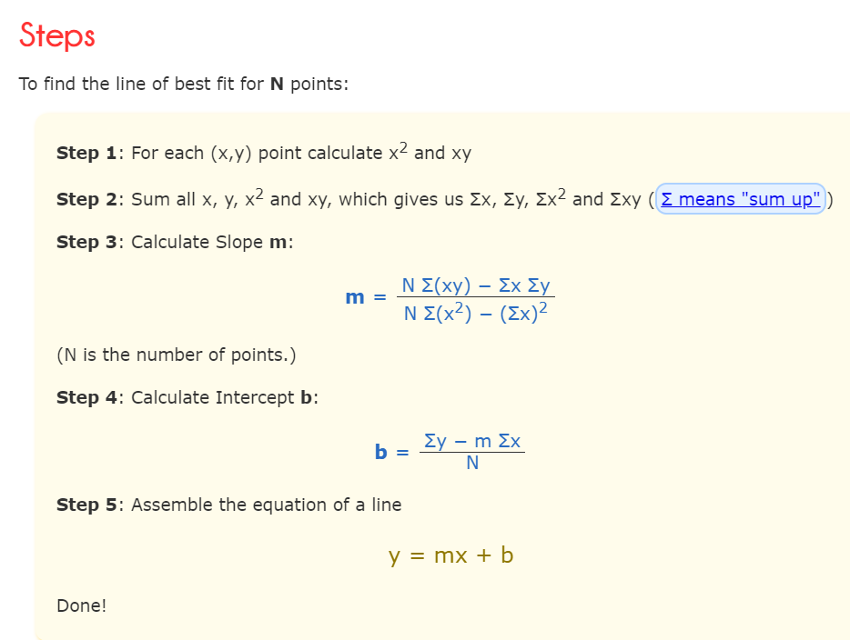
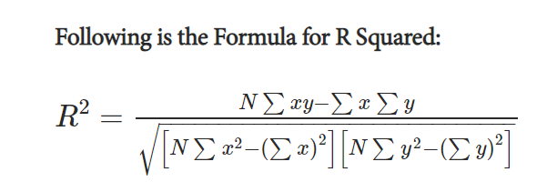

# Regression Models

Regression models describe the relationship between variables by fitting a line to the observed data.

**Linear regression models** use **a straight line**, while **logistic** and **nonlinear regression models** use **a curved line**.

Regression allows you to estimate how **a dependent variable** changes as **the independent variable(s)** change.

Regression is not limited to two variables, we could have 2 or more variables showing a relationship.

The results from the regression help in predicting an unknown value depending on the relationship with the predicting variables. For example, someone’s height and weight usually have a relationship. Generally, taller people tend to weigh more. We could use regression analysis to help predict the weight of an individual, given their height.

## Linear Regression

**Linear regression** is **a linear model**, e.g. a model that assumes **a linear relationship** between the input variables (x) and the single output variable (y). More specifically, that y can be calculated from a linear combination of the input variables (x).

When there is **a single input variable**, the regression is referred to as **Simple Linear Regression**. If there is more than predicting variable, the regression is referred to as **Multiple Linear Regression**.

## Simple linear regression: (Fitting a Straight Line to the data)

**Simple linear regression** is used to **estimate the relationship** between **two quantitative variables**. You can use simple linear regression when you want to know:

1. How strong the relationship is between two variables (e.g. the relationship between rainfall and soil erosion).

2. The value of the dependent variable at a certain value of the independent variable (e.g. the amount of soil erosion at a certain level of rainfall).

### Assumptions of simple linear regression

Simple linear regression is a parametric test, meaning that it makes certain assumptions about the data. These assumptions are:

1. **Homogeneity of variance (homoscedasticity):** the size of the error in our prediction doesn’t change significantly across the values of the independent variable.

2. **Independence of observations:** the observations in the dataset were collected using statistically valid sampling methods, and there are no hidden relationships among observations.

3. **Normality:** The data follows a normal distribution.

4. **The relationship between the independent and dependent variable is linear:** the line of best fit through the data points is a straight line (rather than a curve or some sort of grouping factor).

### Simple linear regression formula

## Multiple linear regression (Fitting a Plane to the data)

**Multiple linear regression** is used to **estimate the relationship** between **two or more independent variables** and **one dependent variable**. You can use multiple linear regression when you want to know:

1. How strong the relationship is between two or more independent variables and one dependent variable (e.g. how rainfall, temperature, and amount of fertilizer added affect crop growth).

2. The value of the dependent variable at a certain value of the independent variables (e.g. the expected yield of a crop at certain levels of rainfall, temperature, and fertilizer addition).

### Assumptions of multiple linear regression

Multiple linear regression makes all of the same assumptions as **simple linear regression**:

1. **Homogeneity of variance (homoscedasticity):** the size of the error in our prediction doesn’t change significantly across the values of the independent variable.

2. **Independence of observations:** the observations in the dataset were collected using statistically valid methods, and there are no hidden relationships among variables. In multiple linear regression, it is possible that some of the independent variables are actually correlated with one another, so it is important to check these before developing the regression model. If two independent variables are too highly correlated (r2 > ~0.6), then only one of them should be used in the regression model.

3. **Normality:** The data follows a normal distribution.

4. **Linearity:** the line of best fit through the data points is a straight line, rather than a curve or some sort of grouping factor.

### Multiple linear regression formula

## Learning a linear regression model

Learning a linear regression model means estimating the values of the coefficients used in the representation with the data that we have available.

In this section we will take a brief look at two techniques to prepare a linear regression model:

### 1. Ordinary Least Squares

**The least-squares** method is a statistical procedure to find **the best fit** for a set of data points by **minimizing the sum of the offsets or residuals** of points from the plotted curve.

### 2. Gradient Descent

When there are one or more inputs you can use a process of optimizing the values of the coefficients by iteratively minimizing the error of the model on your training data.

* This operation is called Gradient Descent and works by starting with random values for each coefficient.

* The sum of the squared errors are calculated for each pair of input and output values.

* A learning rate is used as a scale factor and the coefficients are updated in the direction towards minimizing the error.

* The process is repeated until a minimum sum squared error is achieved or no further improvement is possible.

## R-Squared / Coefficient of Determination

**R-squared** is a goodness-of-fit measure for linear regression models.

This statistic indicates the percentage of the variance in the dependent variable that the independent variables explain collectively.

R-squared measures the strength of the relationship between your model and the dependent variable on a convenient 0 – 100% scale.

After fitting a linear regression model, you need to determine how well the model fits the data. Does it do a good job of explaining changes in the dependent variable?

Usually, the larger the R2, the better the regression model fits your observations.
