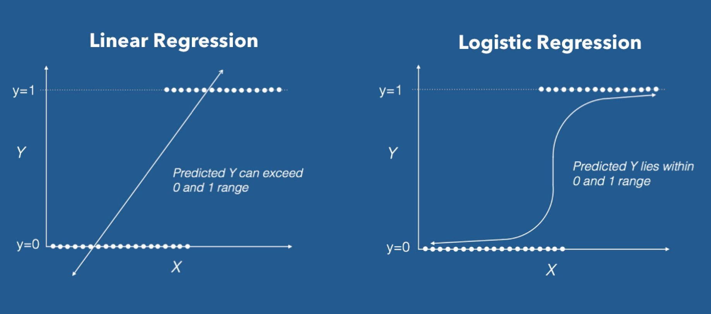
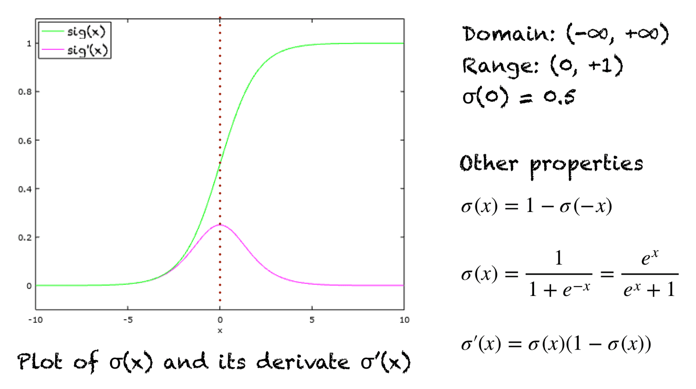
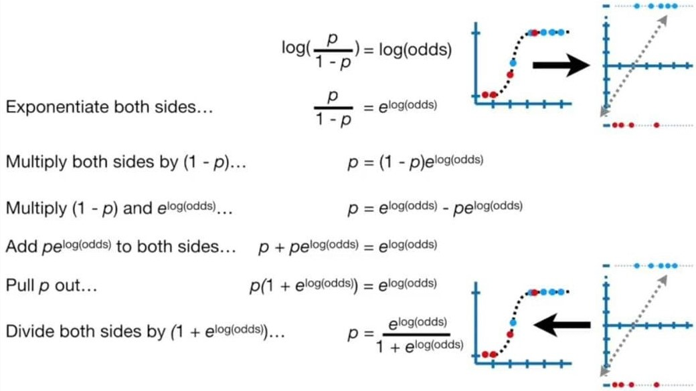
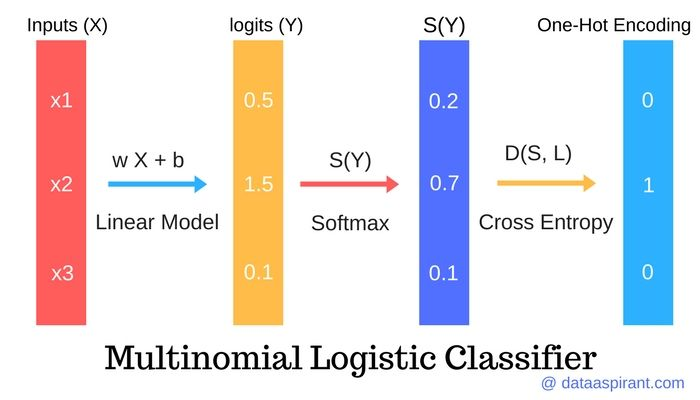
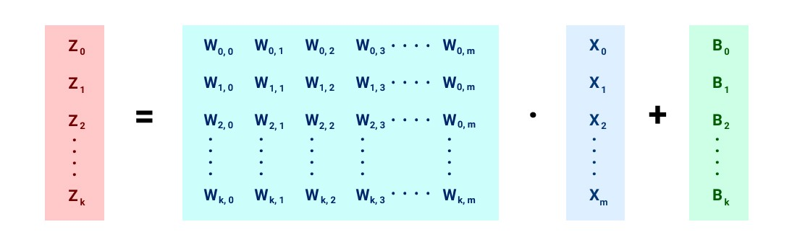
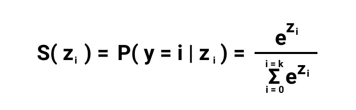

# Logistic Regression (Fitting a Squiggle (S-shaped Curve) to the data)



**Logistic regression** is a classical linear method for binary classification.

**Classification predictive modeling** problems are those that require the prediction of a class label (e.g. ‘red‘, ‘green‘, ‘blue‘) for a given set of input variables.

**Binary classification** refers to those classification problems that have two class labels, e.g. **true/false** or **0/1**.

**Logistic regression** has a lot in common with **linear regression**, although linear regression is a technique for predicting a numerical value, not for classification problems. _Both techniques model the target variable with a line_ (or hyperplane, depending on the number of dimensions of input).

**Linear regression** fits the line to the data, which can be used _to **predict** a new quantity_, whereas **logistic regression** fits a line _to best **separate** the two classes_.

The input data is denoted as **X** with **n** examples and the output is denoted **y** with one output for each input.
The prediction of the model for a given input is denoted as **yhat**.

> **yhat = model(X)**

The model is defined in terms of **parameters** called **coefficients** (**beta**), where there is one coefficient per input and an additional coefficient that provides the intercept or bias.

For example, a problem with inputs **X** with **m** variables **x1, x2, …, xm** will have coefficients **beta1**, **beta2**, …, **betam**, and **beta0**.

A given input is predicted as the **weighted sum** of the inputs for the example and the coefficients.

> **yhat = _beta0_ + _beta1_ \* x1 + _beta2_ \* x2 + … + _betam_ * xm**

The model can also be described using linear algebra, with a vector for the coefficients (Beta) and a matrix for the input data (**X**) and a vector for the output (**y**).

> **y = X * Beta**

So far, this is identical to **linear regression** and is insufficient _as the output will be a real value instead of a class label_.
Instead, the model squashes the output of this weighted sum using a **nonlinear function** to ensure the outputs are a value between **0** and **1**.

The **logistic function** (also called the **sigmoid**) is used, which is defined as:

> **f(x) = 1 / (1 + exp(-x))**
>
> 

Where **x** is the input value to the function. In the case of **logistic regression**, **x** is replaced with the **weighted sum**.

The output is interpreted as a probability from a **Binomial probability distribution function** for the class labeled **1**, if the two classes in the problem are labeled **0** and **1**.

> Notice that the output, being a number between **0** and **1**, can be interpreted as a probability of belonging to the class labeled **1**.

The parameters of the model (**beta**) must be estimated from the sample of observations drawn from the domain.

There are many ways to estimate the parameters. There are two frameworks that are the most common; they are:

* **Least Squares Optimization** (iteratively reweighted least squares).
* **Maximum Likelihood Estimation**.

Both are optimization procedures that involve searching for different model parameters.

## Logistic Regression and Log-Odds

Before we dive into how the parameters of the model are estimated from data, we need to understand what logistic regression is calculating exactly.

**The linear part of the model (the weighted sum of the inputs)** calculates the **log-odds** of **a successful event**, specifically, the log-odds that a sample belongs to class **1**.

> **log-odds = _beta0_ + _beta1_ * x1 + _beta2_ * x2 + … + _betam_ * xm**


In effect, the model estimates the **log-odds** for class **1** for the input variables at each level (all observed values).

### What are odds and log-odds?

**Odds** are often stated as wins to losses (**wins : losses**), e.g. a one to ten chance or ratio of winning is stated as **1 : 10**.

Given the **probability of success** (**p**) predicted by **the logistic regression model**, we can convert it to **odds of success** as the probability of success divided by the probability of not success:

> **odds of success = p / (1 – p)**

The **logarithm of the odds** is calculated, specifically **log base-e** or the natural logarithm. This quantity is referred to as the log-odds and may be referred to as the **logit** (**logistic unit**), a unit of measure.

> **log-odds = log (p / (1 – p)**

#### Recall that this is what the linear part of the logistic regression is calculating

> **log-odds = _beta0_ + _beta1_ * x1 + _beta2_ * x2 + … + _betam_ * xm**

The **log-odds of success** can be converted back into an **odds of success** by calculating the **exponential** of the **log-odds**.

> **odds = exp (log-odds)**

or

> **odds = exp (_beta0_ + _beta1_ * x1 + _beta2_ * x2 + … + _betam_ * xm)**

The **odds of success** can be converted back into a **probability of success** as follows:

> **p = odds / (odds + 1)**

And this is close to the form of our **logistic regression model**, except we want to convert **log-odds** to **odds** as part of the calculation.

We can do this and simplify the calculation as follows:

> **p = 1 / (1 + exp (-log-odds))**

This shows how we go from **log-odds** to **odds**, to a **probability of class 1** with the logistic regression model, and that this final functional form matches the **logistic function**, ensuring that the probability is between **0** and **1**.



> We can make these calculations of converting between **probability**, **odds** and **log-odds** concrete with some small examples in Python.
>
> First, let’s define the probability of success at **80%**, or **0.8**, and convert it to **odds** then back to a **probability** again.
>
> ```Python
> # example of converting between probability and odds
> from math import log
> from math import exp
> 
> # define our probability of success
> prob = 0.8
> print('Probability %.1f' % prob)
> 
> # convert probability to odds
> odds = prob / (1 - prob)
> print('Odds %.1f' % odds)
> 
> # convert back to probability
> prob = odds / (odds + 1)
> print('Probability %.1f' % prob)
> ```
>
> Outputs:
>
> ```Console
> Probability 0.8
> Odds 4.0
> Probability 0.8
> ```
>
> Let’s extend this example and convert the odds to log-odds and then convert the log-odds back into the original probability. This final conversion is effectively the form of the logistic regression model, or the logistic function.
>
> ```python
> # example of converting between probability and log-odds
> from math import log
> from math import 
> 
> # define our probability of success
> prob = 0.8
> print('Probability %.1f' % prob)
> 
> # convert probability to odds
> odds = prob / (1 - prob)
> print('Odds %.1f' % odds)
> 
> # convert odds to log-odds
> logodds = log(odds)
> print('Log-Odds %.1f' % logodds)
> 
> # convert log-odds to a probability
> prob = 1 / (1 + exp(-logodds))
> print('Probability %.1f' % prob)
> ```
>
> Outputs:
>
> ```console
> Probability 0.8
> Odds 4.0
> Log-Odds 1.4
> Probability 0.8
> ```

## Maximum Likelihood Estimation (MLE)

**Density estimation** is the problem of **estimating the probability distribution** for a sample of observations from a problem domain.

There are many techniques for solving density estimation, although a common framework used throughout the field of machine learning is **maximum likelihood estimation**.

Maximum likelihood estimation involves defining a **likelihood function** for _calculating the conditional probability of observing the data sample given a probability distribution and distribution parameters_. This approach can be used to **search** a space of possible distributions and parameters.

### Problem of Probability Density Estimation

A common modeling problem involves how to **estimate a joint probability distribution** for a dataset.

For example, given a sample of observation (**X**) from a domain (**x1**, **x2**, **x3**, …, **xn**), where each observation is drawn independently from the domain with the same probability distribution (so-called independent and identically distributed, i.i.d., or close to it).

Density estimation involves selecting a **probability distribution function** and the **parameters of that distribution** that best explain the joint probability distribution of the observed data (**X**).

There are many techniques for solving this problem, although two common approaches are:

* **Maximum a Posteriori** (**MAP**), a Bayesian method.
* **Maximum Likelihood Estimation** (**MLE**), frequentist method.

The main difference is that **MLE** assumes that all solutions are equally likely beforehand, whereas **MAP** allows prior information about the form of the solution to be harnessed.

### Maximum Likelihood Estimation

One solution to probability density estimation is referred to as Maximum Likelihood Estimation, or MLE for short.

Maximum Likelihood Estimation involves treating the problem as an optimization or search problem, where we seek a set of parameters that results in the best fit for the joint probability of the data sample (X).

First, it involves defining a parameter called **theta** that defines both the choice of the probability density function and the parameters of that distribution. It may be a vector of numerical values whose values change smoothly and map to different probability distributions and their parameters.

In Maximum Likelihood Estimation, we wish to **maximize** the probability of observing the data from the joint probability distribution given a specific probability distribution and its parameters, stated formally as:

> **P(X | theta)**

This conditional probability is often stated using the semicolon (**;**) notation instead of the bar notation (**|**) because **theta** is not a random variable, but instead an unknown parameter. For example:

> **P(X ; theta)**

or

> **P(x1, x2, x3, …, xn ; theta)**

This resulting conditional probability is referred to as the **likelihood of observing the data given the model parameters** and written using the notation **L()** to denote the **likelihood function**. For example:

> **L(X ; theta)**

The objective of Maximum Likelihood Estimation is to find the set of parameters (**theta**) that **maximize** the likelihood function, e.g. result in **the largest likelihood value**.

> **_maximize_ L(X ; theta)**

We can unpack the conditional probability calculated by the likelihood function.

Given that the sample is comprised of **n** examples, we can frame this as the joint probability of the observed data samples **x1**, **x2**, **x3**, …, **xn** in **X** given the probability distribution parameters (**theta**).

> **L(x1, x2, x3, …, xn ; theta)**

The **joint probability distribution** can be restated as the **multiplication** of the **conditional probability** for observing each example given the distribution parameters.

> **product** **i** to **n** **P(xi ; theta)**

_Multiplying many small probabilities_ together can be numerically unstable in practice, therefore, it is common to restate this problem as **the sum of the log conditional probabilities** of observing each example given the model parameters.

> **sum i** to **n log (P(xi ; theta))**
>
> This product over many probabilities can be inconvenient, it is prone to numerical underflow. To obtain a more convenient but equivalent optimization problem, we observe that taking the logarithm of the likelihood does not change its arg max but does conveniently transform a product into a sum

Given the frequent use of **log** in the **likelihood function**, it is commonly referred to as a **log-likelihood function**.

It is common in optimization problems to prefer to **minimize** the cost function, rather than to maximize it. Therefore, the **negative of the log-likelihood function** is used, referred to generally as a **Negative Log-Likelihood (NLL) function**.

> **_minimize_ -sum i** to **n log (P(xi ; theta))**

## Logistic Regression as Maximum Likelihood

We can frame the problem of **fitting a machine learning model** as the problem of **probability density estimation**.

Specifically, the choice of model and model parameters is referred to as **a modeling hypothesis h**, and the problem involves finding **h** that best explains the data **X**. We can, therefore, find the modeling hypothesis that **maximizes the likelihood function**.

> **_maximize_ sum i** to **n log (P(xi ; h))**

Supervised learning can be framed as a conditional probability problem of predicting the probability of the output given the input:

> **P(y | X)**

As such, we can define conditional maximum likelihood estimation for supervised machine learning as follows:

> **_maximize_ sum i** to **n log (P(yi|xi ; h))**

Now we can replace **h** with our logistic regression model.

In order to use maximum likelihood, we need to assume a **probability distribution**.

In the case of **logistic regression**, a **Binomial probability distribution** is assumed for the data sample, where each example is one outcome of a **Bernoulli trial**. The Bernoulli distribution has a single parameter: **the probability of a successful outcome (p)**.

> P(y=1) = p
> P(y=0) = 1 – p
>
> The probability distribution that is most often used when there are two classes is the binomial distribution. This distribution has a single parameter, **p**, that is the probability of an event or a specific class.

The expected value (mean) of the Bernoulli distribution can be calculated as follows:

> **mean = P(y=1) \* 1 + P(y=0) \* 0**

Or, given p:

> **mean = p * 1 + (1 – p) * 0**

This calculation may seem redundant, but it provides the basis for the **likelihood function** for a specific input, where the probability is given by the model (**yhat**) and the **actual labe**l is given from the dataset.

> **likelihood = yhat * y + (1 – yhat) * (1 – y)**

This function will always return a large probability when the model is close to the matching class value, and a small value when it is far away, for both **y=0** and **y=1** cases.

> We can demonstrate this with a small worked example for both outcomes and small and large probabilities predicted for each.
>
>
> ```python
> # test of Bernoulli likelihood function
> 
> # likelihood function for Bernoulli distribution
> def likelihood(y, yhat):
>   return yhat * y + (1 - yhat) * (1 - y)
>  
> # test for y=1
> y, yhat = 1, 0.9
> print('y=%.1f, yhat=%.1f, likelihood: %.3f' % (y, yhat, likelihood(y, yhat)))
> 
> y, yhat = 1, 0.1
> print('y=%.1f, yhat=%.1f, likelihood: %.3f' % (y, yhat, likelihood(y, yhat)))
> 
> # test for y=0
> y, yhat = 0, 0.1
> print('y=%.1f, yhat=%.1f, likelihood: %.3f' % (y, yhat, likelihood(y, yhat)))
> 
> y, yhat = 0, 0.9
> print('y=%.1f, yhat=%.1f, likelihood: %.3f' % (y, yhat, likelihood(y, yhat)))
> ```
>
> Outputs:
>
> ```console
> y=1.0, yhat=0.9, likelihood: 0.900
> y=1.0, yhat=0.1, likelihood: 0.100
> y=0.0, yhat=0.1, likelihood: 0.900
> y=0.0, yhat=0.9, likelihood: 0.100
> ```

We can update the likelihood function using the log to transform it into a **log-likelihood function**:

> **log-likelihood = log(yhat) * y + log(1 – yhat) * (1 – y)**

Finally, we can sum the likelihood function across all examples in the dataset to maximize the likelihood:

> **_maximize_ sum i** to **n log(yhat_i) * y_i + log(1 – yhat_i) * (1 – y_i)**

It is common practice to minimize a cost function for optimization problems; therefore, we can invert the function so that we **minimize the negative log-likelihood**:

> **_minimize_ sum i** to **n - (log(yhat_i) * y_i + log(1 – yhat_i) * (1 – y_i))**

Calculating the **negative of the log-likelihood function** for the Bernoulli distribution is equivalent to calculating the **cross-entropy function** for the Bernoulli distribution, where **p()** represents the probability of class **0** or class **1**, and **q()** represents the estimation of the probability distribution, in this case by our logistic regression model.

> **cross entropy = - (log(q(class0)) * p(class0) + log(q(class1)) * p(class1))**

Unlike **linear regression**, there is not an analytical solution to solving this optimization problem. As such, an **iterative optimization algorithm** must be used (Such as **Gradient Descent**).

## Types of Logistic Regression

### 1. Binary logistic regression

In binary logistic regression, the target variable or the dependent variable is binary in nature i.e. it **has only two possible values**.

> **Ex**: whether a message is a spam message or not.

### 2. Multinomial logistic regression

The target variable in a multinomial logistic regression can take **three or more values** but these values **do not have** any definite order of preference.

> **Ex**: the most preferred type of food (Indian, Italian, Chinese, etc.)

### 3. Ordinal logistic regression

In ordinal logistic regression, the target variable has **three or more possible values** and these values **have** an order or preference.

> **Ex**: star ratings for restaurants

## Decision Boundary

Since **logistic regression prediction function** returns a probability between **0** and **1**, in order to predict which class this data belongs we need to set a **threshold**.

For each data point, if the estimated probability is **above** this threshold, we classify the point into class **1**, and if it's **below** the threshold, we classify the point into class **2**.

> **If P(Y=1∣X) ≥ 0.5, class =1, and if P(Y=1∣X) < 0.5, class =0.**


> Note: **Decision boundary** can be **linear** (a line) or **non-linear** (a curve or higher order polynomial).
> Polynomial order can be increased to get complex decision boundary.

## Linear Regression vs Logistic Regression

Linear Regression | Logistic Regression
------------------|--------------------
Linear regression is used to predict the continuous dependent variable using a given set of independent variables. | Logistic Regression is used to predict the categorical dependent variable using a given set of independent variables.
Linear Regression is used for solving Regression problem. | Logistic regression is used for solving Classification problems.
In Linear regression, we predict the value of continuous variables. | In logistic Regression, we predict the values of categorical variables.
In linear regression, we find the best fit line, by which we can easily predict the output. | In Logistic Regression, we find the S-curve by which we can classify the samples.
Least square estimation method is used for estimation of accuracy. | Maximum likelihood estimation method is used for estimation of accuracy.
The output for Linear Regression must be a continuous value, such as price, age, etc. | The output of Logistic Regression must be a Categorical value such as 0 or 1, Yes or No, etc.
In Linear regression, it is required that relationship between dependent variable and independent variable must be linear. | In Logistic regression, it is not required to have the linear relationship between the dependent and independent variable.
In linear regression, there may be collinearity between the independent variables. | In logistic regression, there should not be collinearity between the independent variable.

## Multinomial logistic regression

Logistic regression is designed for **two-class problems**, modeling the target using a **binomial probability distribution function**. The class labels are mapped to **1** for the positive class or outcome and **0** for the negative class or outcome. The fit model predicts the probability that an example belongs to class **1**.

By default, logistic regression cannot be used for classification tasks that have more than **two class labels**, so-called **multi-class classification**.

Instead, it requires modification to support multi-class classification problems.

One popular approach for adapting logistic regression to multi-class classification problems is to split the multi-class classification problem into **multiple binary classification problems** and fit a **standard logistic regression model** on each subproblem. Techniques of this type include **_one-vs-rest_** and **_one-vs-one_ wrapper models**.

> ### One-Vs-Rest for Multi-Class Classification
>
> **One-vs-rest** (**OvR** for short, also referred to as **One-vs-All** or **OvA**) is a heuristic method for using binary classification algorithms for multi-class classification.
>
> It involves splitting the multi-class dataset into multiple binary classification problems. A binary classifier is then trained on each binary classification problem and predictions are made using the model that is the most confident.
>
> For example, given a multi-class classification problem with examples for each class **‘red**,’ **‘blue**,’ and **‘green‘**. This could be divided into **three** binary classification datasets as follows:
>
> * **Binary Classification Problem 1**: red vs [blue, green]
> * **Binary Classification Problem 2**: blue vs [red, green]
> * **Binary Classification Problem 3**: green vs [red, blue]
>
> A possible downside of this approach is that it requires one model to be created for each class. For example, three classes requires three models. This could be an issue for large datasets (e.g. millions of rows), slow models (e.g. neural networks), or very large numbers of classes (e.g. hundreds of classes).
>
> ### One-Vs-One for Multi-Class Classification
>
> **One-vs-One** (**OvO** for short) is another heuristic method for using binary classification algorithms for multi-class classification.
>
> Like one-vs-rest, one-vs-one splits a multi-class classification dataset into binary classification problems. Unlike one-vs-rest that splits it into one binary dataset for each class, the one-vs-one approach splits the dataset into one dataset for each class versus every other class.
>
> For example, consider a multi-class classification problem with four classes: ‘red,’ ‘blue,’ and ‘green,’ ‘yellow.’ This could be divided into six binary classification datasets as follows:
>
> * **Binary Classification Problem 1**: red vs. blue
> * **Binary Classification Problem 2**: red vs. green
> * **Binary Classification Problem 3**: red vs. yellow
> * **Binary Classification Problem 4**: blue vs. green
> * **Binary Classification Problem 5**: blue vs. yellow
> * **Binary Classification Problem 6**: green vs. yellow
>
> This is significantly more datasets, and in turn, models than the one-vs-rest strategy described in the previous section.
>
> The formula for calculating the number of binary datasets, and in turn, models, is as follows:
>
> **(NumClasses * (NumClasses – 1)) / 2**
>
> Each binary classification model may predict one class label and the model with the most predictions or votes is predicted by the one-vs-one strategy.
>

An alternate approach involves changing the logistic regression model to support the prediction of multiple class labels directly. Specifically, to predict the probability that an input example belongs to each known class label.

The probability distribution that defines multi-class probabilities is called a multinomial probability **distribution**. A logistic regression model that is adapted to learn and predict a multinomial probability distribution is referred to as Multinomial Logistic Regression. Similarly, we might refer to default or standard logistic regression as Binomial Logistic Regression.

* **Binomial Logistic Regression**: Standard logistic regression that predicts a binomial probability (i.e. for two classes) for each input example.
* **Multinomial Logistic Regression**: Modified version of logistic regression that predicts a multinomial probability (i.e. more than two classes) for each input example.

Changing logistic regression from binomial to multinomial probability requires a change to the loss function used to train the model (e.g. log loss to cross-entropy loss), and a change to the output from a single probability value to one probability for each class label (**Use Softmax activation instead of softmax**).



> _Example_: in this example we have 5 categories so we have 5 linear models
>
> 
> then we apply **softmax activation**
> 
