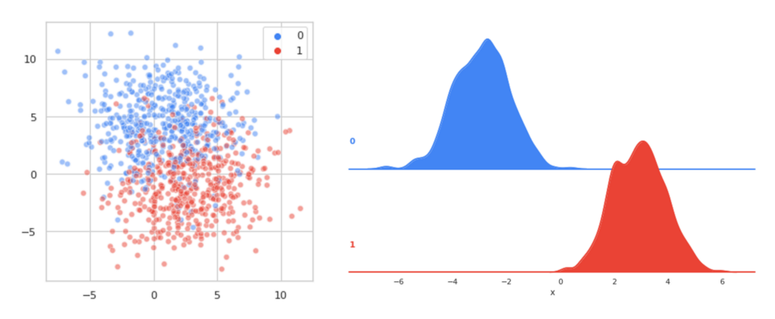
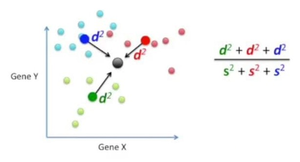
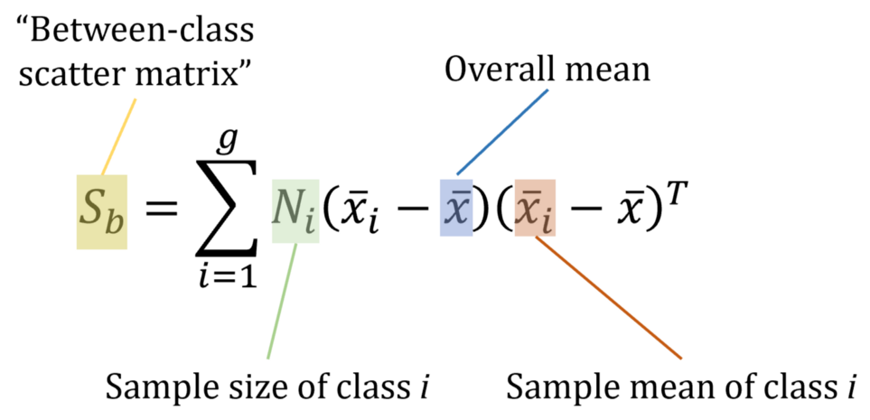
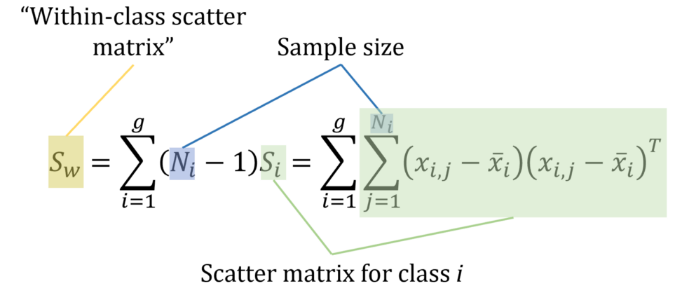

# Linear Discriminant Analysis (LDA)

Linear discriminant analysis is used as a tool for **classification**, **dimension reduction**, and **data visualization**. It has been around for quite some time now.

Despite its simplicity, LDA often produces robust, decent, and interpretable classification results. When tackling real-world classification problems, LDA is often the first and benchmarking method before other more complicated and flexible ones are employed.

## PCA vs LDA

**Linear Discriminant Analysis (LDA)** is, like **Principle Component Analysis (PCA)**, a method of **dimensionality reduction**. However, both are quite different in the approaches they use to reduce dimensionality.

While **PCA** (unsupervised technique) chooses new axes for dimensions such that **variance** (and hence the ‘shape’) of the data is **preserved**, **LDA** chooses new axes such that the **separability** between two classes is **optimized**, and hence is a supervised technique.

Hence, when one discusses using dimensionality reduction **not** for visualization purposes (which would require a retention of shape) but to **increase model performance**, usually they are talking about **LDA**. Both, however, represent the newly formed dimensions in terms of **linear combinations** of dimensions in the dataset.

> (i) PCA is an unsupervised algorithm. It ignores class labels altogether and aims to find the principal components that maximize variance in a given set of data. Linear Discriminant Analysis, on the other hand, is a supervised algorithm that finds the linear discriminants that will represent those axes which maximize separation between different classes.
>
> (ii) Linear Discriminant Analysis often outperforms PCA in a multi-class classification task when the class labels are known. In some of these cases, however, PCA performs better. This is usually when the sample size for each class is relatively small. A good example is the comparisons between classification accuracies used in image recognition technology.
>
> (iiI) Many times, the two techniques are used together for dimensionality reduction. PCA is used first followed by LDA.

## Performing LDA is a three-step process

### Step 1 (between-class variance)

Calculate the **‘separability’** between the classes. Known as the **between-class variance**, it is defined as the distance between the mean of different classes, and allows for the algorithm to put a quantitative measure on ‘how difficult’ the problem is (closer means = harder problem).

This separability is kept in a ‘**between-class scatter matrix**’.

### Step 2 (within-class variance)

Compute the **within-class variance**, or the distance between the mean and the sample of every class. This is another factor in the difficulty of separation — higher variance within a class makes clean separation more difficult.

Si is the covariance matrix for the class i.

### Step 3 (Maximize the following matrix: Maximize Sb and Minimize Sw)

$$S_w^{-1} S_b$$

Construct a **lower-dimensional space** that **maximizes** the **between-class variance** (‘separability’) and **minimizes** the **within-class variance**.

Known as **Fisher’s Criterion**, Linear Discriminant Analysis can be computed using **singular value decomposition (SVD)**, **eigenvalues**, or using a **least squares method**.

In the **scikit-learn** implementation, singular value decomposition is preferred by default because it does not compute a costly covariance matrix and hence works more efficiently for higher-dimensional data.

## Representation of LDA Models

The representation of LDA is straight forward.

It consists of **statistical properties** of your data, calculated for each class.

* For a single input variable (**x**) this is the **mean** and the **variance** of the variable for each class.

* For multiple variables, this is the same properties calculated over the multivariate Gaussian, namely the **means** and the **covariance matrix**.

These statistical properties are estimated from your data and plug into the LDA equation to make predictions.

## Learning LDA Models

LDA makes some simplifying assumptions about your data:

1. Your data is Gaussian, that each variable is is shaped like a bell curve when plotted.
2. Each attribute has the same variance, that values of each variable vary around the mean by the same amount on average.

With these assumptions, the LDA model estimates the **mean** and **variance** from your data for each class.

It is easy to think about this in the univariate (single input variable) case with two classes.

The mean (**mu**) value of each input (variable) (**x**) for each class (**k**) can be estimated in the normal way by dividing the sum of values by the total number of values:

> **muk = sum(x) / nk**
Where **muk** is the mean value of **x** for the class **k**, **nk** is the number of instances with class **k**.

The variance is calculated across **all classes** as the average squared difference of each value from the **mean** (Global Mean):

> **sigma^2 = sum((x – mu)^2) / (n-K)**
> Where **sigma^2** is the variance across all inputs (variables/features) (**x**), **n** is the number of instances, **K** is the number of classes and **mu** is the overall mean x.

## Making Predictions with LDA

LDA makes predictions by estimating the probability that a new set of inputs belongs to each class.

The class that gets the highest probability is the output class and a prediction is made.

The model uses **Bayes Theorem** to estimate the probabilities. Briefly Bayes’ Theorem can be used to estimate the probability of the output class (**k**) given the input (**x**) using the **probability of each class** and the **probability of the data belonging to each class**:

> **P(Y=k|X=x) = (PIk * fk(x)) / sum(PIl * fl(x))**

Where:

* **x** = an input.
* **k** = output class.
* **Plk** = **nk/n**, or base probability of each class observed in the training data. It is also called prior probability in Bayes’ Theorem. (e.g. 0.5 for a 50-50 split in a two class problem)
* **fk(x)** = estimated probability of x belonging to class **k**.

A **Gaussian distribution function** is used for **f(x)**.

Plugging the Gaussian into the above equation and simplifying we end up with the equation below. This is called a **discriminate function** and the class is calculated as having the largest value will be the output classification (y):

> **Dk(x) = x * (muk/sigma^2) – (muk^2 /(2*sigma^2)) + ln(PIk)**

**Dk(x)** is the discriminate function for class **k** given input **x**, the **muk**, **sigma^2** and **PIk** are all estimated from your data.

## Extensions to LDA

Linear Discriminant Analysis is a simple and effective method for classification. Because it is simple and so well understood, there are many extensions and variations to the method. Some popular extensions include:

1. **Quadratic Discriminant Analysis (QDA)**: Each class uses its own estimate of variance (or covariance when there are multiple input variables).
2. **Flexible Discriminant Analysis (FDA)**: Where non-linear combinations of inputs is used such as splines.
3. **Regularized Discriminant Analysis (RDA)**: Introduces regularization into the estimate of the variance (actually covariance), moderating the influence of different variables on LDA.

The original development was called the **Linear Discriminant** or **Fisher’s Discriminant Analysis**. The **multi-class version** was referred to **Multiple Discriminant Analysis**. These are all simply referred to as **Linear Discriminant Analysis** now.
