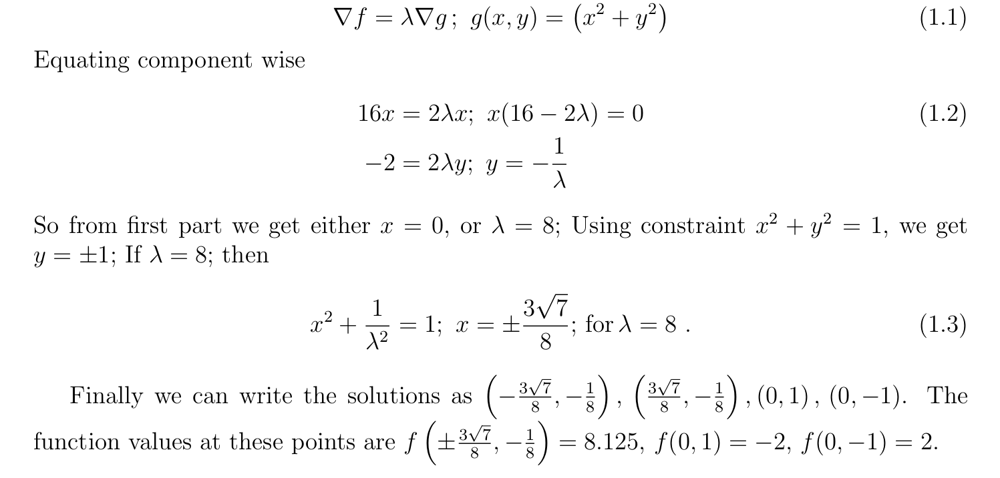

# Lagrange multipliers (Optimization with Constraints)

The Lagrange multiplier technique lets you find the **maximum** or **minimum** of a multivariable function **f(x, y, ..)** when there is some **constraint** on the input values you are allowed to use.

This technique only applies to constraints that look something like this: **g(x, y, ..) = c**.
Here, **g** is another multivariable function with the same input space as **f** and **c** is some constant.

The core idea is to look for points where the contour lines of **f** and **g** are **tangent** to each other.

This is the same as finding points where the gradient vectors of **f** and **g**  are **parallel** to each other.

The entire process can be boiled down into setting the **gradient** of a certain function, called the **Lagrangian**, equal to the **zero vector**.

## Step 1

Introduce a new variable **λ**, and define a new function **L** as follows:

This function **L** is called the "**Lagrangian**", and the new variable **λ** is referred to as a "**Lagrange multiplier**"

## Step 2

Set the gradient of **L** equal to the zero vector.

In other words, find the **critical points** of **L**

## Step 3

Consider each solution, which will look something like: **(x0, y0, .. , λ0)**, remove the **λ** component, then plug it into **f**.
Whichever one gives the **greatest** (or **smallest**) value is the **maximum** (or **minimum**) point your are seeking.

## Lagrange Multiplier Demystified

Suppose we have a mountain that looks like below:

The height of a location **(x, y)** is given as follows (in kilometers):

Further suppose, the mountain has an eruption:

From the **top**, it looks like below:

The **eruption area** is given as follows:

This means **the edge of the eruption** is given as follows:

So, the **edge** looks like this:

Suppose we want to know the **highest position of the eruption** on this mountain.
This means the **highest position** must be on the **edge line of the eruption** which we can express as follows:

Any location (**x, y)** that satisfies **g(x, y) = 0** is on the edge of the eruption.
Therefore, the **constrained optimization problem** is to find the **maximum f(x, y)** _satisfying_ **g(x, y) = 0**.

Intuitively, we know that the maximum height of the eruption is around where the blue arrow indicates.

We are looking for the **highest contour line** that **touches** the **edge of the eruption**.

Let’s define the contour line equation:

> **f(x, y) = H**

**H** is a constant value indicating the **height of the contour**.

For a given value of **H**, there are a set of **(x, y)** values that satisfies **f(x, y) = H**.

The **gradient** (The direction of steepest ascent) of **f(x, y)** indicates the **direction** where the **height is increasing** which is **perpendicular** to the contour line.

The **gradient** is a **vector of partial derivatives**:

Similarly, the **gradient of g(x, y)** is **perpendicular** to the **edge of the eruption area**:

The **highest contour line** that **touches** the **edge of the eruption** must have the **gradient of f(x, y)** in **parallel** to the **gradient of g(x, y)**:

> If the **gradient of the contour line** is not in **parallel** with the **gradient of the eruption edge**, there will be some eruption area that is located **higher** than the contour line.
>
> 

So, we need to find such point **(x, y)** where the **gradient of f(x, y)** is in **parallel** to the **gradient of g(x, y)**.

> **grad f(x, y) = λ grad g(x, y)**
>
> **grad { f(x, y) - λ g(x, y) } = 0**

The **zero** here means the vector with zeros: **(0,0)**.

And we call the inside of the curly brackets as the **Lagrangian L**:

> **L = f(x, y) - λ g(x, y)**

So, we are saying that the following is the required condition:

> **grad L = 0**

The gradient of the Lagrangian gives us two equations:

## Example of solving a constrained Optimization problem

So we found the **maximum** and **minimum** values of the function and see that it has a **unique minimum**, **two maxima** and a **saddle point**.

If we plot these functions f and g, then we will understand the concept of Lagrange multiplier even better.

From the figure above we can clearly appreciate that the **extrema** of constrained function **f**, **lie on the surface** of the constraint **g**, which is a circle of unit radius. It is a necessary condition.

Also the **tangent vectors** of the **function** and the **constraint** are either **parallel** or **anti-parallel** at each **extremum**.

> **Parallel Vs Anti-Parallel**
>
> 
