# Support Vector Machines (SVMs)

> The **support vector machine** is a generalization of a classifier called **maximal margin classifier**. The maximal margin classifier is simple, but it cannot be applied to the majority of datasets, since the classes must be separated by a linear boundary.
>
> That is why the **support vector classifier** was introduced as an **extension** of the **maximal margin classifier**, which can be applied in a broader range of cases.

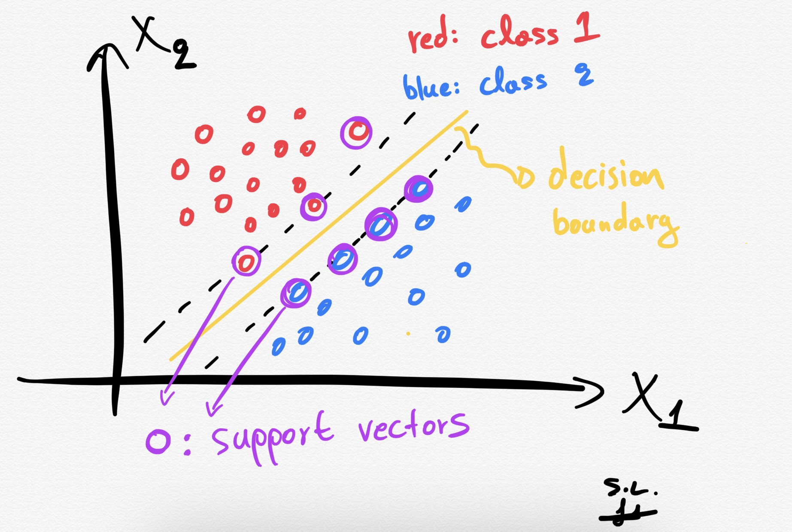

**SVMs** are supervised machine learning models that are usually employed for **classification** (**SVC — Support Vector Classification**) or **regression** (**SVR — Support Vector Regression**) problems. Depending on the characteristics of target variable (that we wish to predict), our problem is going to be a classification task if we have a discrete target variable (e.g. class labels), or a regression task if we have a continuous target variable (e.g. house prices).

> ## Basic Linear Algebra
>
> ### Vectors
>
> Vectors are mathematical quantity which has both **magnitude** and **direction**. A point in the 2D plane can be represented as a vector between origin and the point.
>
> 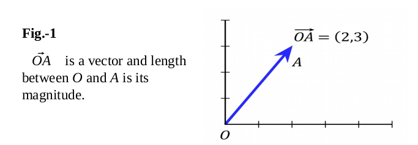
>
> ### Length of Vectors (L2 norm of a vector)
>
> Length of vectors are also called as **norms**. It tells how far vectors are from the origin.
>
> 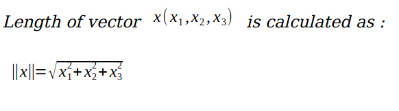
>
> ### Direction vector (unit vector - A vector that has a magnitude of 1)
>
> it is generally used to denote the direction of a vector.
> 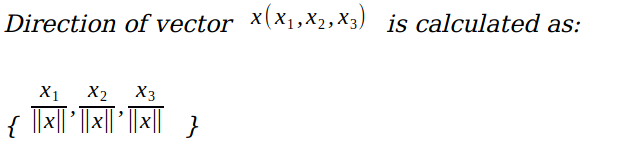
>
> ### Dot Product
>
> Dot product between two vectors is a scalar quantity . It tells how to vectors are related.
>
> 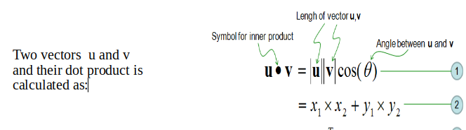
>
> ### Distance between a Line and a Point
>
> 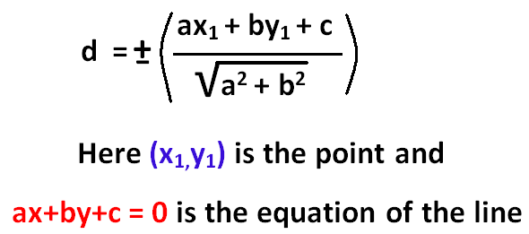

For our convenience, we will explain the concepts with respect to two dimensional space and lines which can be extended to greater than two dimensional space and hyper-planes.

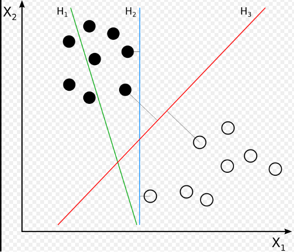

Let us consider the above figure. We have two kinds of datapoints here. Consider that the datapoints marked in **black color filled** belong to **positive class** and the datapoints marked with **black color border** belong to **negative class**.

We have three straight lines which can divide the datapoints two classes, but the main question is : “ **Which straight line is the best for the classification task ?**“.

## What is a Hyperplane (Decision Boundary)

A hyperplane in an **n-dimensional Euclidean space** is a flat affine, **n-1 dimensional** sub-space of that n-D space that divides the space into two disconnected parts.

* in **one dimension**, a hyperplane is called a **point**
* in **two dimensions**, it is a **line**
* in **three dimensions**, it is a **plane**
* in **more dimensions** you can call it an **hyperplane**

> In 2-D Space, A hyperplane is line divides data point into two classes:
> 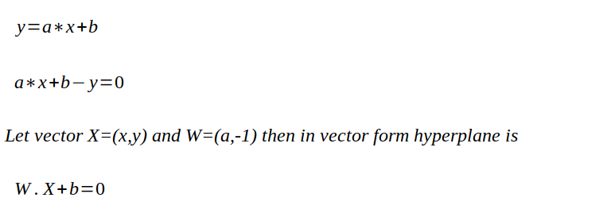
>
> **Or**  - a*x + y - b = 0
>
> let vector X = (x, y) and W = (-a, 1) -> **W.X - b = 0**

Mathematically, the hyperplane is simply:

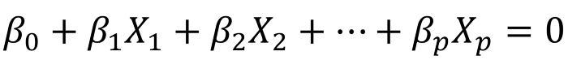

If X satisfies the equation above, then the point lies on the plane. Otherwise, it must be on one side of the plane as shown below.

## Optimal HyperPlane

By **optimal hyper-plane** we are referring to that separating hyper-plane from which the data points of classes are at **farthest distance** away on either side.

The optimal hyper-plane is defined by the plane that **maximizes** the **perpendicular distance** between the hyper-plane and **the closest samples**.

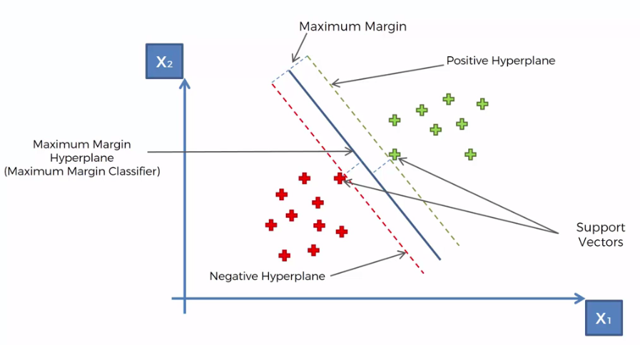

We can see that there are three parallel hyper-planes:

1. The hyper-plane that is touching the points of the **positive class** is called the **positive hyper-plane**.
2. The hyper-plane that is touching the points of the **negative class** is called the **negative hyper-plane**.
3. The hyper-plane that is situated **in between** the positive and negative class is called the **separating hyper-plane**.

## Margin

The distance between the positive and negative hyper-plane is called the **“margin”**.

If we maximize the margin, then positive and negative points are quite far away from each other as well as from the separating hyper-plane. Hence the accuracy of the classification task increases.

The **wider** the margin, the **better** it is for the classification task. As margin increases, the “generalization accuracy” (Accuracy of the model on future unseen data points) increases.

**SVMs** try to find a hyper-plane, that **maximizes** the margin. Hence the **optimal separating hyper-plane** is also called **“margin-maximizing hyper-plane”**.

## Support Vectors

Support Vectors are those data points that **touch** the **positive** and **negative** **hyper-planes**. In the figure above, we can see that there are some data points which **first touch** the positive and negative hyper-planes, these data points are known as “Support Vectors”.

> The **vector points closest to the hyperplane** are known as the **support vector points** because only these two points are contributing to the result of the algorithm, other points are not. If a data point is not a support vector, removing it has no effect on the model. On the other hands, deleting the support vectors will then change the position of the hyperplane.

Note : For future unseen data points we will use the **position** , **direction** and **side of** the data point, **only** with respect to the **separating hyper-plane** to decide the class of the data points( and not the positive and negative hyper-planes).

## Geometric Intuition about SVMs

In this section, we will be using the concept of **“Convex Hull”** in order to find the **margin-maximizing hyper-plane**.

**Convex Hull** can be defined as the smallest convex polygon such that all its points are either inside the polygon or on the polygon.

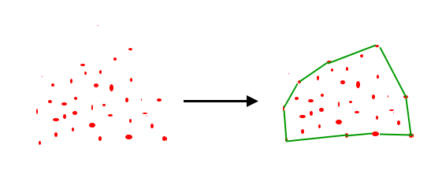

In order to find the margin-maximizing hyper-plane using the concept of Convex Hull, we will use the following steps:

1. First draw the convex hull for **positive data points**.
2. Second draw the convex hull for **negative data points**.
3. Third find the **shortest line** or hyper-plane connecting the hulls.
4. Finally , draw the line or hyper-plane that **bisects** the line or hyper-plane (drawn in the third step). This line or hyper-plane obtained is referred to as the “margin-maximizing hyper-plane”.

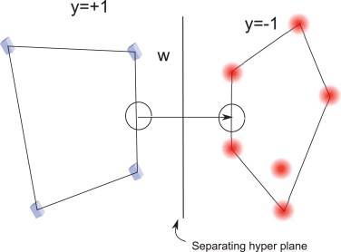

## Mathematical Formulation of SVMs

Let us consider that the positive and negative hyper-planes are at unit distances away from the separating hyper-plane.

## Hard Margin SVM


### Calculating the margin (Distance between the positive hyperplane and negative hyperplane)


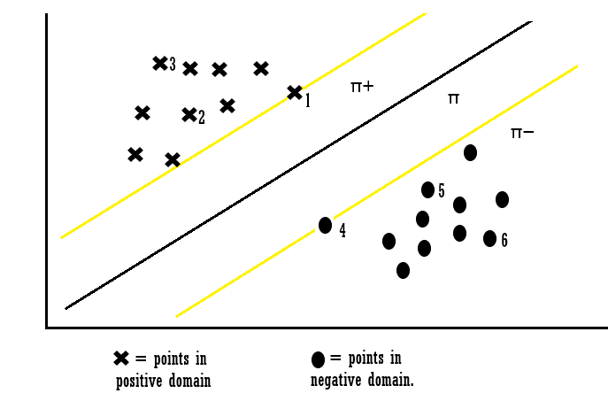

**Hard Margen SVM** problem can be formulated as (Constraints on correct classification):

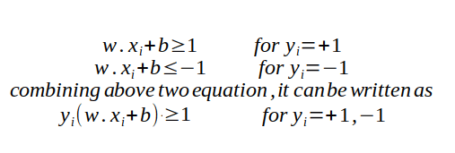

> Assume **3 hyperplanes** namely **(π, π+, π−)** such that ‘**π+**’ is parallel to ‘**π**’ passing through the support vectors on the **positive** side and ‘**π−**’ is parallel to ‘**π**’ passing through the support vectors on the **negative** side.
>
> for the point **X1** :
>
> 
>
> **x1** lies on the hyperplane **π+** and the equation determines that the product of our actual output and the hyperplane equation is **1** which means the point is **correctly** classified in the **positive** domain.
>
> for the point **X3**:
>
> 
>
> **x3** lies away from the hyperplane **π+** and the equation determines that the product of our actual output and the hyperplane equation is greater **1** which means the point is **correctly** classified in the **positive** domain.
>
> for the point **X4**:
>  
> 
>
> **x4** lies on the hyperplane **π−** and the equation determines that the product of our actual output and the hyperplane equation is equal to **1** which means the point is **correctly** classified in the **negative** domain.
>
> for the point **X6**:
>
> 
>
> **x6** lies away from the hyperplane **π−** and the equation determines that the product of our actual output and the hyperplane equation is greater **1** which means the point is **correctly** classified in the **negative** domain.
> ___
> 
>
> for point **X7**:
>
> 
>
> **x7** is classified incorrectly because for point **7** the **wT + b** will be **smaller than one** and this **violates** the **constraints**. So we found the **misclassification** because of **constraint violation**.
>
> Similarly, we can also say that for point **X8**.
> ___
> Thus from the above examples, we can conclude that for any point **Xi**:
>
> if **Yi(WT*Xi +b) ≥ 1**:
>
> then **Xi** is **correctly** classified
>
> else:
>
> **Xi** is **incorrectly** classified.

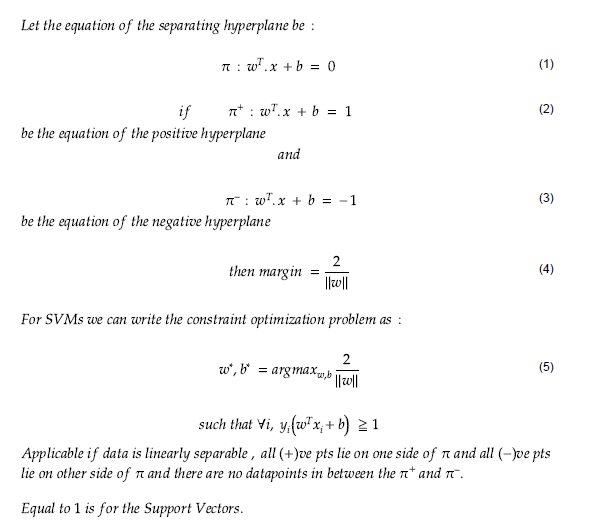

So we can see that if the points are **linearly separable** then our hyperplane is able to distinguish between them and if any **outlier** is introduced then it is not able to separate them.

So these type of **SVM** is called as **hard margin SVM** (since we have very **strict constraints** to **correctly** classify each and every datapoint).

## Soft Margin SVM

> This idea is based on a simple premise:
>
> allow SVM to make a certain number of **mistakes** and keep margin as **wide** as possible so that **other points** can still be classified **correctly**. This can be done simply by modifying the objective of SVM.

Let us briefly go over the motivation for having this kind of formulation:

* Almost all real-world applications have data that is **linearly inseparable**.
* In rare cases where the data is **linearly separable**, we might not want to choose a decision boundary that **perfectly** separates the data to avoid **overfitting**.

For example, consider the following diagram:


Here the **red decision boundary** perfectly separates all the training points. However, is it really a good idea of having a decision boundary with such less margin? Do you think such kind of decision boundary will generalize well on unseen data?

The answer is: **No**. The **green decision boundary** has a wider margin that would allow it to generalize well on unseen data. In that sense, soft margin formulation would also help in avoiding the **overfitting** problem.

### How it Works (mathematically)?

we will **relax the constrains** of the equation slightly to allow the **margin violation** to occur with the help of **positive slack variable ξi**. so now above equation can be written as:


**ξi** actually tells where the **ith** observation is located relative to **hyperplane and margin**:

* For **0 < ξi ≤ 1**, then observation is between **incorrect side of margin and correct side of hyperplane**.This is **margin violation**.

* For **ξi > 1** ,observation is on the **incorrect side of both hyperplane and margin**, and point is **misclassified**.

And in the soft margin classification task, the observation which is on the incorrect side of margin have penalty which increases as distance from it increases.

**C** is the parameter which controls the _**trade-off** between length of margin and number of the misclassification_ on the training data:

* For **C = 0**, It is not letting any misclassification to occur which is a nothing but **hard margin classification** and it result in **narrow margin**

* For **C > 0**, it means **some observation** can violate the margin, as **C** increases margin also **widens**.

> #### C = 1.0
>
> 
>
> #### C = 1000
>
> 
>
> #### C = 100000
>
> 

The correct value of **C** is decided by **cross-validation** and it is this parameter only, that can result in **bias-variance trade-off** in SVM:

* If the value of **C = 0**, it results in **high variance**

* if the value of **C = ∞** it results in **high bias**.


## Hinge Loss Formulation of SVMs

One key characteristic of the SVM and the Hinge loss is that the **boundary** separates **negative** and **positive** instances as **+1** and **-1**, with **-1** being on the **left side** of the boundary and **+1** being on the **right**.


The **x-axis** represents the distance from the boundary of any single instance, and the **y-axis** represents the loss size, or penalty, that the function will incur depending on its distance.

There are a few things to note here:

1. That **dotted line** on the **x-axis** represents the number **1**. This means that when an instance’s distance from the boundary is **greater** than or **at** **1**, our loss size is **0**.
2. If the distance from the boundary is **0** (meaning that the instance is **literally on the boundary**), then we incur a loss size of **1**.
3. We see that **correctly classified** points will have a **small**(or **none**) loss size, while **incorrectly classified** instances will have a **high** loss size.
4. A **negative distance** from the boundary incurs a **high** hinge loss. This essentially means that we are on the **wrong side** of the boundary, and that the instance will be classified **incorrectly**.
5. On the flip size, a **positive distance** from the boundary incurs a **low** hinge loss, or no hinge loss at all, and the further we are away from the boundary(and on the **right side** of it), the **lower** our hinge loss will be.

> Now, let’s examine the hinge loss for a number of predictions made by a hypothetical SVM:
>
> ```Console
>      actual  predicted  hinge loss
> ==================================
> [0]   +1        0.97       0.03 
> [1]   +1        1.20       0.00      
> [2]   +1        0.00       1.00       
> [3]   +1       -0.25       1.25
> 
> [4]   -1       -0.88       0.12       
> [5]   -1       -1.01       0.00
> [6]   -1       -0.00       1.00
> [7]   -1        0.40       1.40
> ```
>
> * **[0]**: the actual value of this instance is +1 and the predicted value is 0.97, so the hinge loss is very small as the instance is very far away from the boundary.
> * **[1]**: the actual value of this instance is +1 and the predicted value is 1.2, which is greater than 1, thus resulting in no hinge loss
> * **[2]**: the actual value of this instance is +1 and the predicted value is 0, which means that the point is on the boundary, thus incurring a cost of 1.
> * **[3]**: the actual value of this instance is +1 and the predicted value is -0.25, meaning the point is on the wrong side of the boundary, thus incurring a large hinge loss of 1.25
> * **[4]**: the actual value of this instance is -1 and the predicted value is -0.88, which is a correct classification but the point is slightly penalised because it is slightly on the margin
> * **[5]**: the actual value of this instance is -1 and the predicted value is -1.01, again perfect classification and the point is not on the margin, resulting in a loss of 0
> * **[6]**: the actual value of this instance is -1 and the predicted value is 0, which means that the point is on the boundary, thus incurring a cost of 1.
> * **[7]**: the actual value of this instance is -1 and the predicted value is 0.40, meaning the point is on the wrong side of the boundary, thus incurring a large hinge loss of 1.40

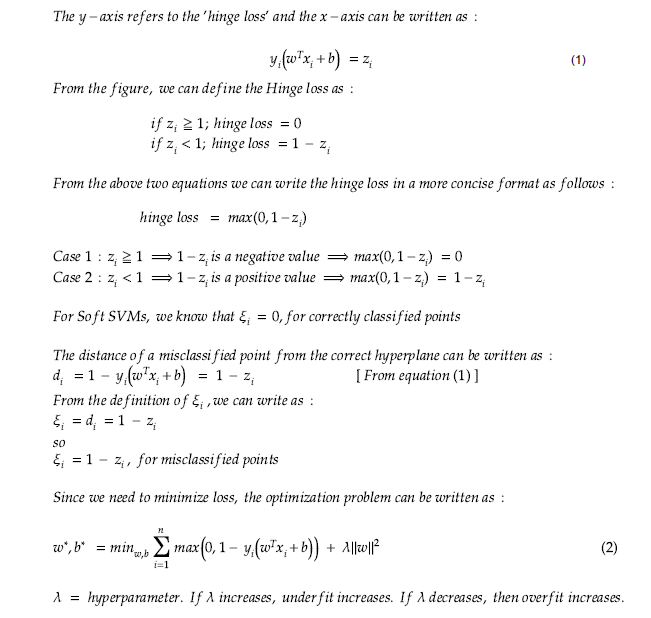

Note : It can be proved that the optimization equation obtained in this section and the optimization equation obtained in the previous section are same. Only **C** and **lambda** are inversely related to each other i.e **C = 1 /lambda**

## Dual Form of SVM Formulation

### General method to solve for minima/maxima

To find the optima for a curve generally, we can just:

1. Take the **first-order derivative**,
2. Equate the **derivative to 0** (for **maxima** or **minima**), to get a differential equation.
3. Solve the differential equation to find the **optimal points**.
4. The **2nd order derivative** can provide the **direction** & hence we can deduce whether the optima is a **minimum** or a **maximum**.

### Solving for minima when constraints are present

If there are some constraints in the differential equation, like the one we have in our Primal hard margin problem:


and the **inequality constraint** is:


> Or equivalently, the **equality condition**:
>
> 

we’ll first need to apply the **Lagrangian multipliers**.


> it’s just the Objective function, subtracted by the inequality constraint!
>
> It must only satisfy the criteria **αᵢ > 0** when the constraint is an **equality constraint** (**αᵢ = 0** for points which are **Non-support_vector**)

To find the optima, we take the **first-order derivative** and equate it to **0**:


To find the optimal values, we can simply substitute the values back into **(5)**.

Expanding **Eq. (5)** we get:


Now substituting the values in **(6)** & **(7)** to above:


We can resubstitute the value of **w** in **Eq. (6)** to the above equation:


Here, **W** is called the Objective functional & it is a function of all **(αᵢ … to … αₙ)** represented as **Λ** (Capital Lambda).

While the **primal problem** was minimized, **W** has to be maximized.

This is called the **DUAL FORMULATION** because the initial Objective function has been modified!

> **The main advantage of Dual SVM is that**: maximization will depend **only** on the **dot product (Xi . Xj) of pairs of support vector**.

## Kernel Trick in SVM

## Non-linear transformations

If the data is **not linearly separable** in the original, or input, space then we apply transformations to the data, which map the data from the **original space** into a **higher dimensional feature space**.

The goal is that after the transformation to the higher dimensional space, the classes are **now linearly separable** in this higher dimensional feature space. We can then fit a decision boundary to separate the classes and make predictions. The decision boundary will be a **hyperplane** in this higher dimensional space.

It is obviously hard to visualize higher dimensional data, and so we first focus on some transformations applied to **1-dimensional data**:

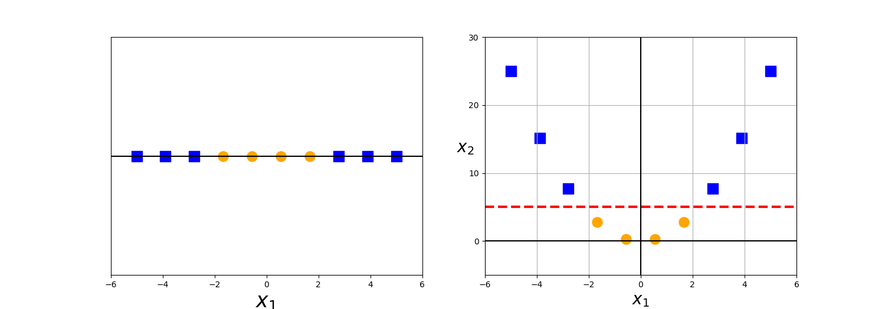

In this example, the picture on the left shows our original data points. In **1-dimension**, this data is **not linearly separable**, but after applying the transformation **ϕ(x) = x²** and adding this second dimension to our feature space, the classes become linearly separable.

For now, we are just examining transformations of the original data to higher dimensions that allow the data to be linearly separated. These are just functions, and there are many possible functions that can map the data to any number of higher dimensions.

Here we apply the transformation **ϕ(x) = x mod 2**

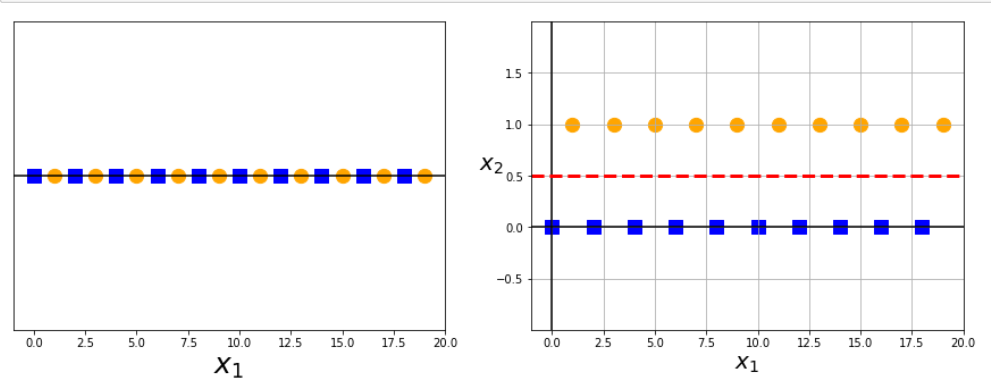

Now let’s look at an example where our original data is not linearly separable in **two dimensions**:

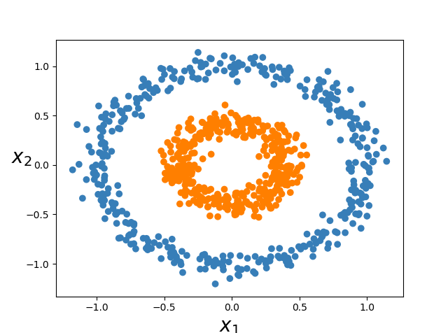

After the following transformation:

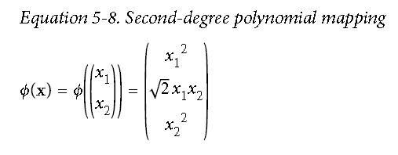

Our data becomes **linearly separable** (by a **2-d plane**) in 3-**dimensions**:

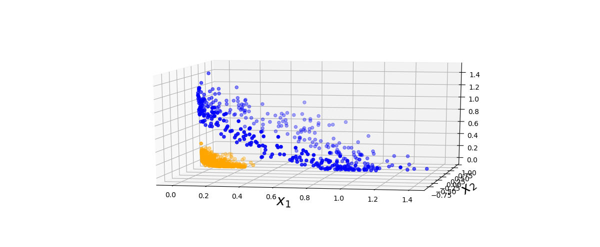

There can be many transformations that allow the data to be linearly separated in higher dimensions, but not all of these functions are actually **kernels**.

## Kernel functions (kernalization)

**Kernel functions** are generalized functions that take **two vectors** (of any dimension) as input and output a **score** that denotes **how similar** the input vectors are.

simple Kernel function you already know is the **dot product** function: if the dot product is small, we conclude that vectors are different and if the dot product is large, we conclude that vectors are more similar.

> ### **More On Kernel Functions**
>
> Kernel is a way of computing the **dot product** of two vectors **x** and **y** in some (possibly **very high dimensional**) **feature space**, which is why kernel functions are sometimes called “**generalized dot product**”.
>
> 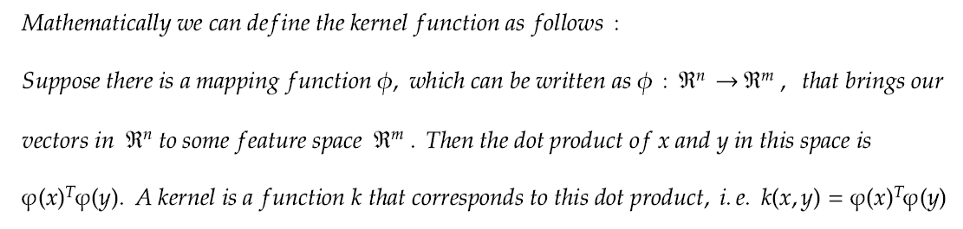
>
> Kernel is useful because it gives us a way to compute **dot products** in some feature space **without** even knowing what this space is and what is **phi**.
>
> 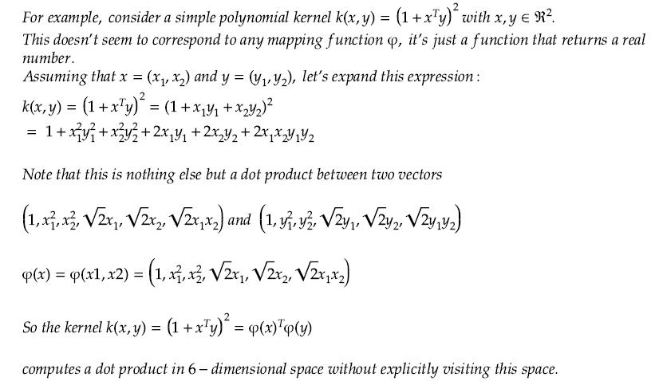
>
> What **kernalization** does is that it takes data which is **‘d’ dimensional** and it does a **feature transform _internally_ and _implicitly_** using the kernel trick to a **dimension ‘d1’** , typically where **d1 > d**.
In **‘d1’** , the data becomes linearly separable.

## Kernel Trick

The **kernel function** has a **special property** that makes it particularly useful in training support vector models, and the use of this property in optimizing non-linear support vector classifiers is often called the **kernel trick**.

We have seen how higher dimensional transformations can allow us to separate data in order to make classification predictions. It seems that in order to train a support vector classifier and optimize our objective function, we would have to _perform operations with the higher dimensional vectors_ in the **transformed feature space**.

In real applications, there might be many features in the data and applying transformations that involve many polynomial combinations of these features will lead to extremely high and impractical computational costs.

The **kernel trick** provides a solution to this problem.
The **“trick”** is that **kernel methods** represent the data only through a **set of pairwise similarity comparisons** between the **original data observations x** (with the original coordinates in the lower dimensional space), instead of explicitly applying the transformations **ϕ(x)** and representing the data by these transformed coordinates in the higher dimensional feature space.

Let us look at the objective function for the linearly separable case:

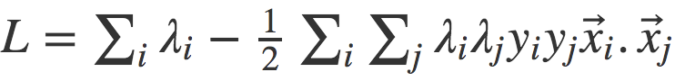

What we can observe from the equation above, is that our objective depends on the **dot product** of input vector pairs **(x_i . x_j)**, which is nothing but a **Kernel function**.

Now here’s a good thing: we don’t have to be restricted to a simple Kernel function like dot product. We can use any **fancy Kernel function** in place of dot product that has the capability of **measuring similarity in higher dimensions** (where it could be more accurate), **without** increasing the computational costs much. This is essentially known as the **Kernel Trick**.

> A **Kernel function** can be written mathematically as follows:
>
> 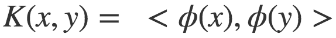
>
> Here **x** and **y** are input vectors, **ϕ** is a transformation function and **< , >** denotes **dot product operation**.
> In the case of dot product function, **ϕ** just maps the input vector to itself.
>
> Kernel functions essentially take the **dot product of _transformed_ input vectors**.

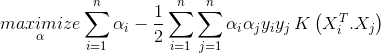

## Types of kernels

### 1. polynomial kernel

For **degree-d polynomials**, the polynomial kernel is defined as:

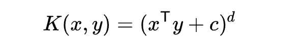

where **x** and **y** are vectors in the input space, i.e. vectors of features computed from training or test samples and **c ≥ 0** is a free parameter **trading off** the influence of higher-order versus lower-order terms in the polynomial. When **c = 0**, the kernel is called **homogeneous**.

A further generalized polykernel divides **xT . y** by a user-specified scalar parameter **a**

The effect of the degree of a polynomial kernel:


Higher degree polynomial kernels allow a more flexible decision boundary.

### 2. Gaussian kernel

It is a general-purpose kernel; used when there is no prior knowledge about the data. Equation is:

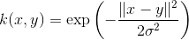


### 3. Radial Basis Function (RBF)

It is a general-purpose kernel; used when there is no prior knowledge about the data.


where **𝛾 > 0**.

A special case is **𝛾 = 1/2𝜎²**

**gamma** is a parameter of the **RBF kernel** and can be thought of as the **‘spread’** of the kernel and therefore the decision region.

* When **gamma is low**, the **‘curve’** of the decision boundary is very **low** and thus the **decision region** is very **broad**.
* When **gamma is high**, the **‘curve’** of the decision boundary is **high**, which creates i**slands of decision-boundaries** around data points.

> ### Gamma = 0.01
>
> 
>
> #### Gamma = 100.0
>
> 

### 3. Sigmoid Kernel

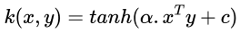

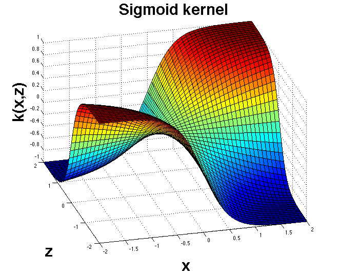

## Multiclass Classification Using SVMs

In its most simple type, SVM **doesn’t support** multiclass classification **natively**. It supports **binary classification** and separating data points into **two classes**.

For multiclass classification, the same principle is utilized after breaking down the multiclassification problem into **multiple binary classification problems**.

The idea is to map data points to **high dimensional space** to gain mutual linear separation between **every two classes**. This is called a **One-to-One approach**, which breaks down the multiclass problem into multiple binary classification problems. _A binary classifier per each pair of classes_.

Another approach one can use is **One-to-Rest**. In that approach, the breakdown is set to _a binary classifier per each class_.

A single SVM does binary classification and can differentiate between two classes. So that, according to the two breakdown approaches, to classify data points from **m** classes data set:

* In the **One-to-Rest** approach, the classifier can use **m** SVMs. Each SVM would predict membership in one of the **m** classes.
* In the **One-to-One** approach, the classifier can use **m(m-1) / 2** SVMs.

Let’s take an example of **3 classes** classification problem; **green**, **red**, and **blue**, as the following image:


Applying the two approaches to this data set results in the followings:

### One-to-One approach

In the **One-to-One** approach, we need a hyperplane to separate between **every two classes**, **neglecting** the points of **the third class**. This means the separation takes into account **only** the points of the **two classes** in the current split.

For example, the **red-blue line** tries to **maximize the separation** only between **blue** and **red** points. It has **nothing** to do with **green** points:


### One-to-Rest approach

In the **One-to-Rest** approach, we need a hyperplane to separate between **a class** and **all others** at **once**. This means the separation takes all points into account, dividing them into **two groups**; a group for the class points and a group for **all other points**.

For example, the **green line** tries to maximize the separation between **green points** and **all other points** at **once**:


