# Iris Flower classification using multiple ML Algorithms:

The different species of iris flowers that are used in this project are: 
1. **Setosa**
2. **Virginica** 
3. **Versicolor**

We will use the **length** and **width** of **sepal** and **petal** to predict the flowers' species.

## Dataset

index | sepal_length | sepal_width | petal_length | petal_width | class
-------------|-------------|--------------|-------------|------|------
0 | 5.1 | 3.5 | 1.4 | 0.2 | Iris-setosa
1 | 4.9 | 3.0 | 1.4 | 0.2 | Iris-setosa
2 | 4.7 | 3.2 | 1.3 | 0.2 | Iris-setosa
3 | 4.6 | 3.1 | 1.5 | 0.2 | Iris-setosa
4 | 5.0 | 3.6 | 1.4 | 0.2 | Iris-setosa
5 | 5.4 | 3.9 | 1.7 | 0.4 | Iris-setosa
6 | 4.6 | 3.4 | 1.4 | 0.3 | Iris-setosa
7 | 5.0 | 3.4 | 1.5 | 0.2 | Iris-setosa
8 | 4.4 | 2.9 | 1.4 | 0.2 | Iris-setosa
9 | 4.9 | 3.1 | 1.5 | 0.1 | Iris-setosa
.. | .. | .. | .. | .. | .. 

## Data Visualization

We have visualized the data (using **Matplotlib**, **Pandas** and **Seaborn**) in different plots, such as:

1. **Scatter Plots**
2. **Histograms**
3. **Line Charts**
4. **Bar Charts**
5. **Box and whisker plots**
6. **Heatmaps**
7. **Facet plots**
8. **Pair plots**

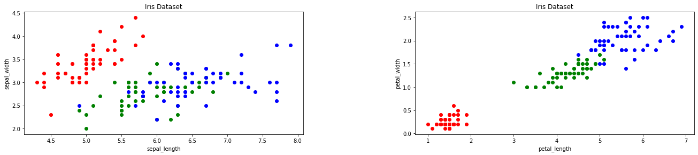 | 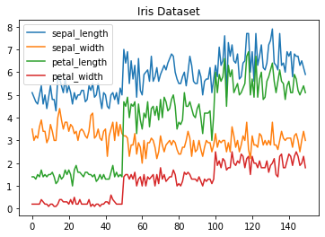 | 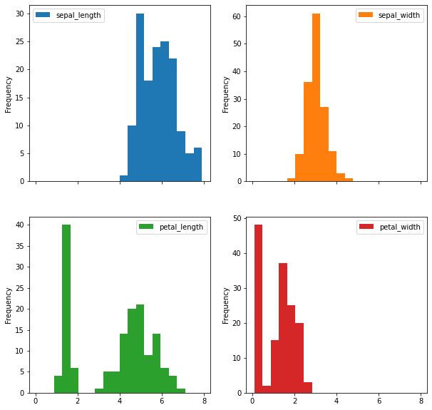 
---------|----------|---------
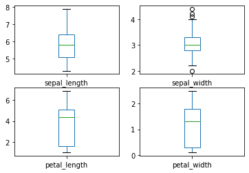 | 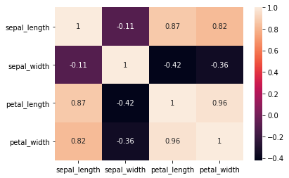 | 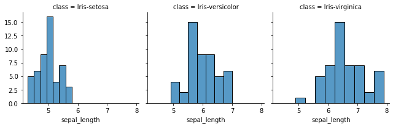
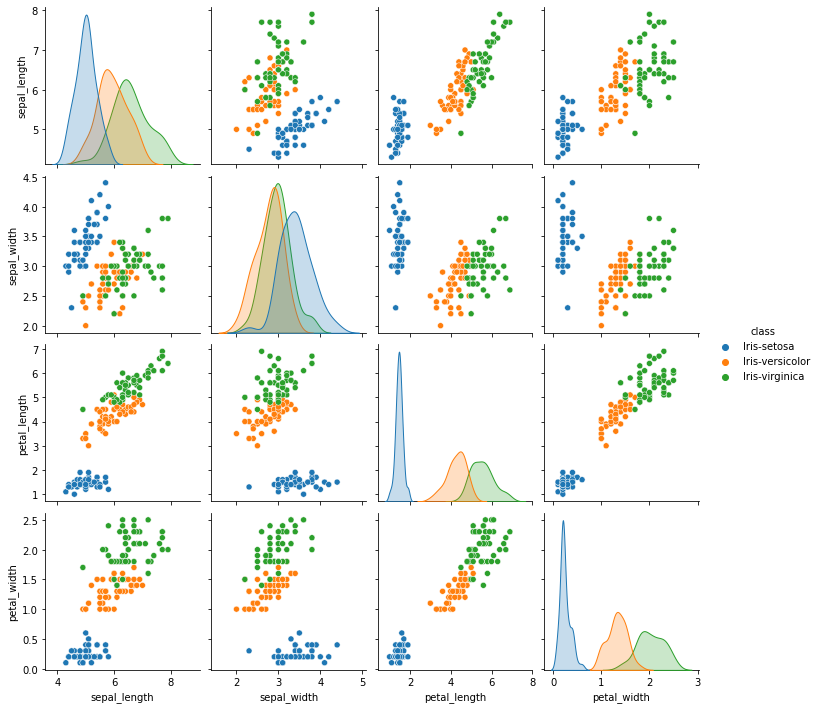 | 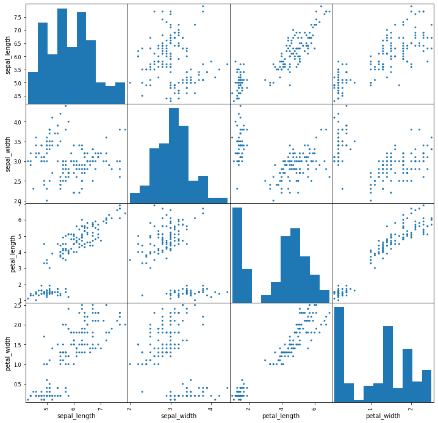 | 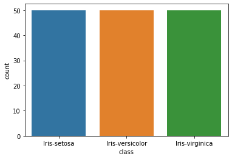

## Data Classification

**Stratified Cross-Validation** was used to evaluate the following Classification algorithms:

1. **Logistic Regression**
2. **Linear discriminant Analysis**
3. **K-Nearest Neighbour**
4. **Classification and Regression Trees**
5. **Gaussian Naive Bayes**
6. **Support Vector Machines**
7. **Random Forest**

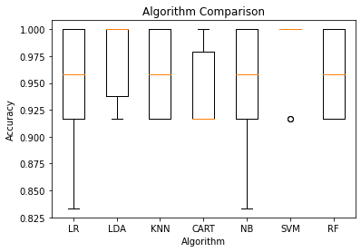

The results suggested that the **SVM** was perhaps the most accurate model. So we used this model as our **final model**.

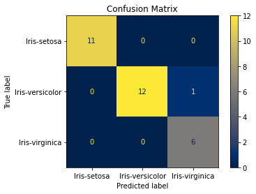

